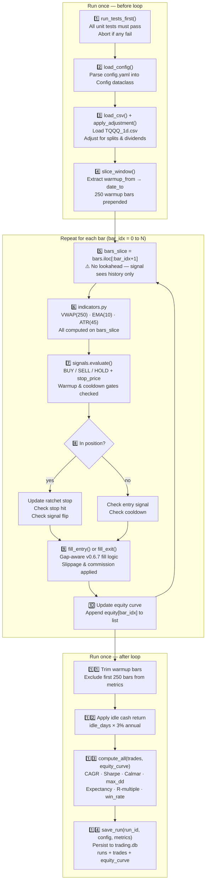
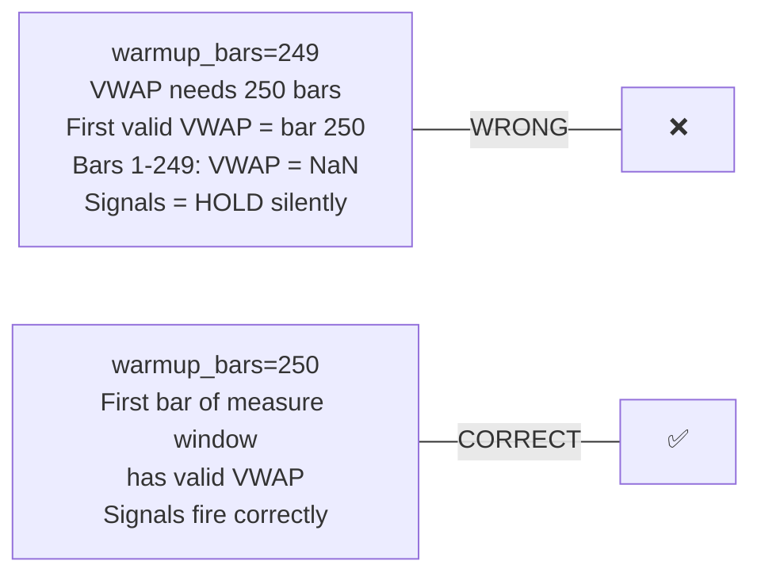
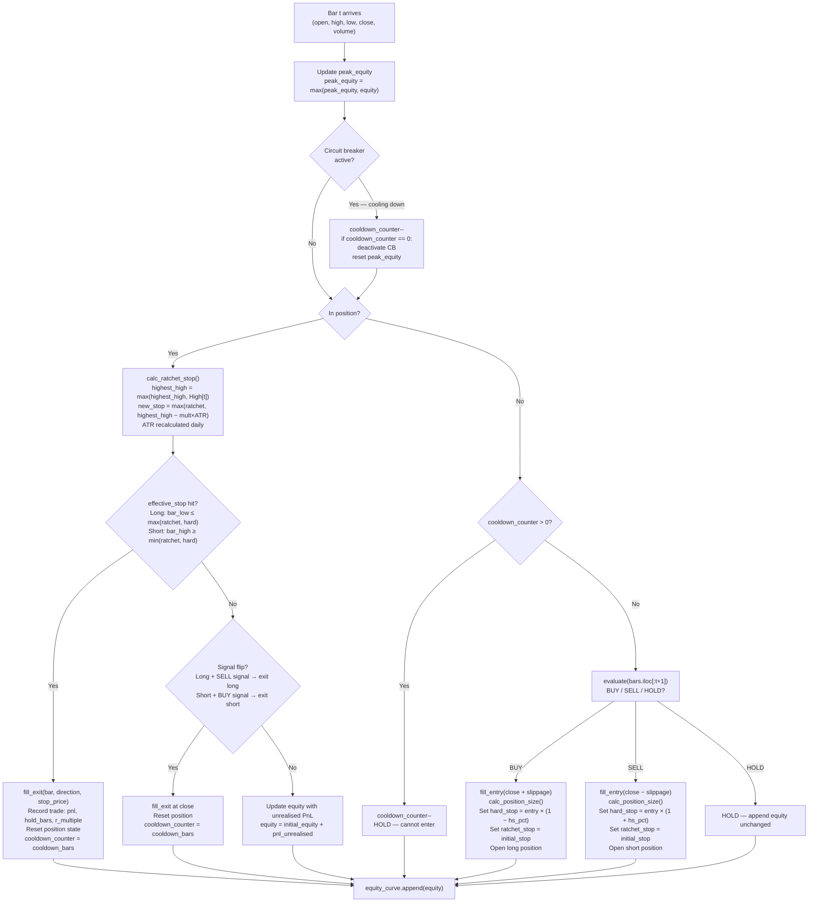
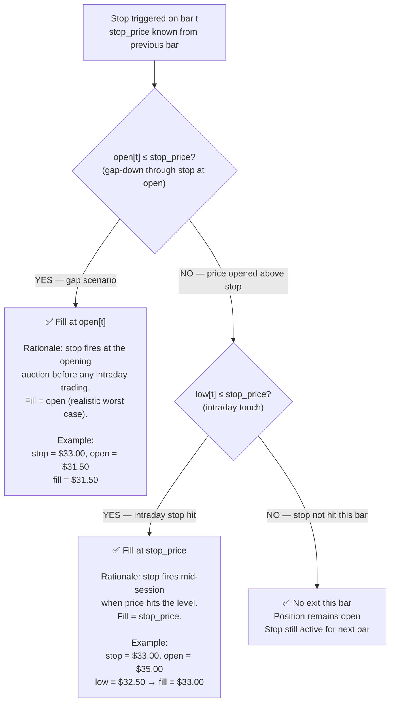
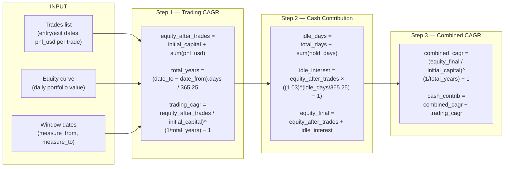
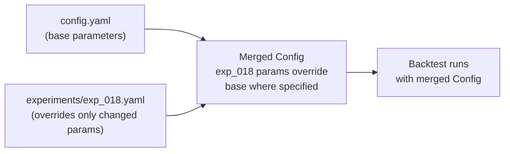
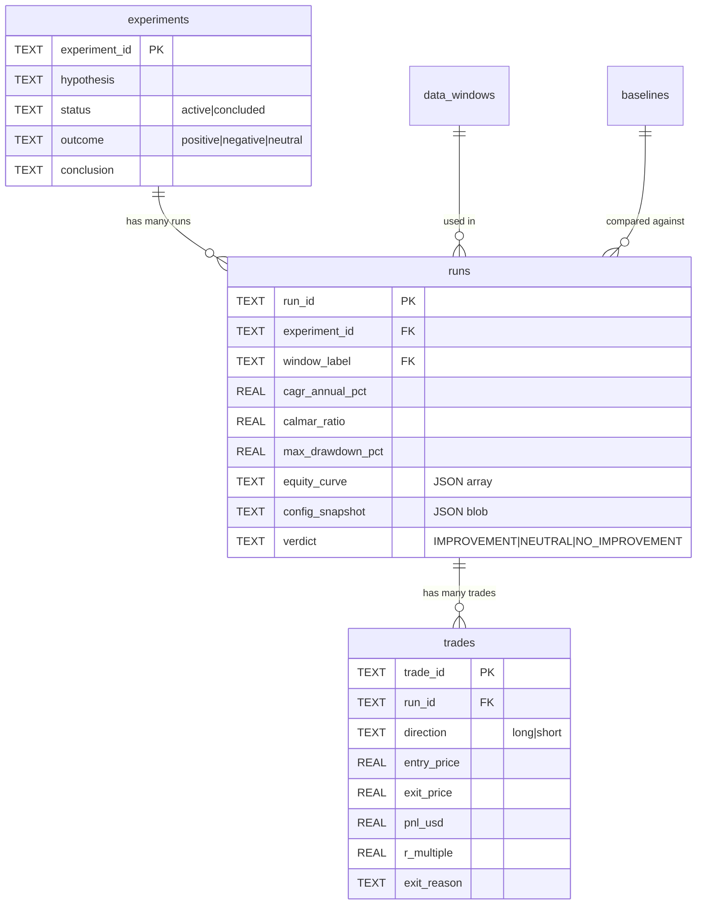

# Backtest Engine

> **Plain English:** The backtest engine replays the strategy on 15 years of historical TQQQ data, bar by bar, as if you were trading live — but using only information available at that moment in time. It simulates realistic order fills, tracks portfolio equity, and records every trade and metric so results can be compared across experiments.

**Related pages:** [Strategy Logic](Strategy-Logic) · [Performance Metrics Guide](Performance-Metrics-Guide) · [Ref-Data-Backtest](Ref-Data-Backtest) · [Experiment Results](Experiment-Results) · [Data Windows Reference](Data-Windows-Reference)

---

## Table of Contents

1. [How to Run a Backtest](#how-to-run-a-backtest)
2. [Overall Pipeline](#overall-pipeline)
3. [Step 1 — Data Loading & Preparation](#step-1-data-loading-and-preparation)
4. [Step 2 — Window Slicing & Warmup](#step-2-window-slicing-and-warmup)
5. [Step 3 — The Bar-by-Bar Simulation Loop](#step-3-the-bar-by-bar-simulation-loop)
6. [Step 4 — Fill Logic v0.6.7 Gap-Aware](#step-4-fill-logic)
7. [Step 5 — Metrics Computation](#step-5-metrics-computation)
8. [Step 6 — Database Persistence](#step-6-database-persistence)
9. [Circuit Breaker in Backtest](#circuit-breaker-in-backtest)
10. [Volatility Position Sizing](#volatility-position-sizing)
11. [Running Multiple Experiments](#running-multiple-experiments)
12. [How Results Are Stored](#how-results-are-stored)

---

## How to Run a Backtest

```bash
# Single backtest using config.yaml
python 01-Backtest/backtest/run.py

# With a specific experiment YAML
python 01-Backtest/backtest/run.py --experiment exp_018_atr_wider

# All windows for one experiment
python 01-Backtest/scripts/run_all_windows.py \
    --experiment exp_018_atr_wider --windows all

# Phase 2 parameter sweep
python 01-Backtest/scripts/run_phase2.py

# Compare two runs
python 01-Backtest/backtest/run.py --diff run_20260319_001 run_20260319_002
```

> **Safety gate:** `run.py` always calls `run_tests_first()` before executing any backtest. If any unit test fails, the backtest aborts. This is non-negotiable — see [Testing Guide — run_tests_first()](Testing-Guide#run_tests_first).

---

## Overall Pipeline

> **How to read:** Each numbered box is a phase. Data flows downward. The dashed box in the middle (the simulation loop) repeats for every bar in the dataset. Everything outside the loop runs once.



---

## Step 1 — Data Loading and Preparation

### Loading the CSV

```python
df = load_csv("02-Common/data/TQQQ_1d.csv")
```

**What `load_csv()` does:**
1. Reads the CSV with `pandas.read_csv()`
2. Parses `date` column as datetime and sets it as the index
3. Validates required columns: `date`, `open`, `high`, `low`, `close`, `volume`, `adj_close`
4. Raises `ValueError` if any required column is missing

### Applying Price Adjustment

```python
df = apply_adjustment(df)
```

**What `apply_adjustment()` does:**
1. Computes `factor = adj_close / close` for every row
2. Multiplies Open, High, Low by the factor
3. Replaces Close with Adj_Close
4. Raises `ValueError` if any close price is zero (prevents division by zero)
5. Returns a new DataFrame — does not modify input

**Why adjustment matters (example):**

| Date | Raw Close | Adj_Close | Factor | Raw High | Adj_High |
|------|-----------|-----------|--------|----------|----------|
| 2020-03-18 | $20.00 | $18.00 | 0.90 | $21.50 | $19.35 |
| 2020-03-19 | $19.00 | $17.10 | 0.90 | $20.00 | $18.00 |

Without adjustment, a 3:1 split creates a -66% price drop overnight, generating a massive false SELL signal.

**Function references:** [`load_csv()`](Ref-Data-Backtest#load_csv) · [`apply_adjustment()`](Ref-Data-Backtest#apply_adjustment)

---

## Step 2 — Window Slicing and Warmup

### What is a data window?

A [data window](Glossary#data_window) defines the date range for a backtest run. 18 windows are defined — see [Data Windows Reference](Data-Windows-Reference).

Each window has three dates:

```
warmup_from   ← 250 bars before measure_from
measure_from  ← start of performance measurement
measure_to    ← end of performance measurement
```

### How slicing works

```python
bars = slice_window(df, warmup_from, measure_to)
```

This extracts `warmup_bars + measurement_bars` rows. The warmup bars run through the simulation loop to initialise VWAP(250), EMA(10), and ATR(45), but their trades and equity values are **excluded from metrics**.

### Why 250 warmup bars?



The warmup must equal or exceed the longest indicator period (VWAP=250). See [Impact Matrix — Warmup Bars](Impact-Matrix#warmup-bars).

---

## Step 3 — The Bar-by-Bar Simulation Loop

This is the core of the engine. Located in `01-Backtest/backtest/runner.py → run_symbol()`.

### State tracked across bars

```python
equity          = config.backtest.initial_capital   # e.g. $20,000
position        = None                              # None or {'direction', 'entry_price', 'shares', ...}
cooldown_counter = 0                                # bars remaining before re-entry allowed
peak_equity     = equity                            # for circuit breaker drawdown calc
highest_high    = None                              # running max for ratchet (long)
lowest_low      = None                              # running min for ratchet (short)
ratchet_stop    = None                              # current ratchet stop price
hard_stop       = None                              # fixed at entry
equity_curve    = []                                # one value per bar
trades          = []                                # completed trades
```

### Per-bar processing — detailed



### Lookahead prevention — the critical nine characters

Every signal evaluation uses a slice of data up to and including the current bar only:

```python
# Inside runner.py process_bar():
signal = evaluate(
    bars.iloc[:bar_idx + 1],   # ← slice: only past + current bar
    config,
    symbol,
    current_position,
    cooldown_counter
)
```

Passing `bars` (the full DataFrame) instead of `bars.iloc[:bar_idx + 1]` is lookahead bias. It allows the strategy to "see" future prices, producing massively inflated results that are worthless for real trading.

**Test that verifies this:** `test_no_lookahead_bias()` in `02-Common/tests/unit/test_signals.py` — plants a signal at bar 50 and verifies it does not fire before bar 50.

---

## Step 4 — Fill Logic

### v0.6.7 Gap-Aware Fill Logic

The fill logic determines the actual execution price when a stop is triggered. Two bugs were fixed across versions v0.6.6 and v0.6.7. All DB results use v0.6.7.

> **How to read the diagram:** Follow the decision tree from top. The first check is whether the stock gapped through the stop at the open. If yes, we fill at open (realistic). If no, we check whether the stop was touched intraday. Each path produces a different fill price.



### Bug history — why the fill logic matters

| Version | Scenario | Old behaviour | v0.6.7 behaviour | CAGR impact |
|---------|----------|--------------|-----------------|-------------|
| Pre-v0.6.6 | Stop=$33, open=$35, low=$32.50, close=$36 | Fill at close=$36 (stop "recovered") | Fill at stop=$33 | -10 to -15pp CAGR |
| v0.6.6 | Stop=$33, open=$31.50 (gap-down) | Fill at close=$28 (missed gap) | Fill at open=$31.50 | +1 to +3pp CAGR |
| **v0.6.7** | Both scenarios | ❌ Wrong fills | ✅ Correct fills | **Baseline** |

**Real-world example (Oct 26, 2023 TQQQ):**

```
Position: Long TQQQ
Stop price: $15.80
Bar open:   $15.77  ← opens BELOW stop (gap-down)
Bar close:  $15.03  ← closes even lower

v0.6.6 fill: $15.03  (filled at close — ignores gap)  → -15.47% trade loss
v0.6.7 fill: $15.77  (filled at open — gap-aware)     → -11.22% trade loss
Improvement: +4.25pp on a single trade
```

**Function reference:** [`fill_exit(bar, direction, stop_price, config)`](Ref-Data-Backtest#fill_exit)

### Entry fill logic

```python
# Long entry: pay slightly above close to simulate market impact
fill_price = close + (close × slippage_pct)   # e.g. close=$35, slippage=0.05% → $35.0175

# Short entry: receive slightly below close
fill_price = close - (close × slippage_pct)
```

Commission is applied separately: `$1.00 per trade` (configurable via `execution.commission`).

**Function reference:** [`fill_entry(bar, direction, config)`](Ref-Data-Backtest#fill_entry)

---

## Step 5 — Metrics Computation

After the simulation loop completes, `compute_all()` calculates all performance metrics from the trades list and equity curve.

### 3-Component CAGR Formula

> **How to read:** Three separate calculations contribute to the final CAGR number. Trading CAGR measures pure strategy P&L. Cash contribution measures the return earned on idle capital. Combined is the headline number shown in all result tables.



### Worked example — full_cycle_2 window

```
initial_capital    = $20,000
equity_after_trades = $161,628   (after 48 trades over 9.2 years)
total_days         = 3,361       (2017-01-01 → 2026-03-16)
total_years        = 3,361 / 365.25 = 9.20 years

Step 1 — Trading CAGR:
  trading_cagr = (161,628 / 20,000)^(1/9.20) − 1
               = (8.08)^(0.1087) − 1
               = 1.2508 − 1 = 25.08%

Step 2 — Cash Contribution:
  time_in_market = 38% → idle_days = 9.20 × 365.25 × 0.62 = 2,083 days
  idle_interest  = 161,628 × ((1.03)^(2083/365.25) − 1)
                 = 161,628 × ((1.03)^5.70 − 1)
                 = 161,628 × 0.185 = $29,901
  equity_final   = 161,628 + 29,901 = $191,529

Step 3 — Combined CAGR:
  combined_cagr = (191,529 / 20,000)^(1/9.20) − 1 = 28.42%
  cash_contrib  = 28.42% − 25.08% = 3.34%
```

### All metrics computed by `compute_all()`

| Metric | Formula | DB column |
|--------|---------|-----------|
| Combined CAGR | 3-component formula above | `cagr_annual_pct` |
| Trading CAGR | Pure trade P&L component | `trading_cagr_pct` |
| Cash contribution | CAGR from idle cash | `cash_contribution_pct` |
| Sharpe ratio | `mean(returns) / std(returns) × √252` | `sharpe_ratio` |
| Sortino ratio | `mean(returns) / std(downside) × √252` | `sortino_ratio` |
| Calmar ratio | `cagr / |max_drawdown|` | `calmar_ratio` |
| Max drawdown | Peak-to-trough % | `max_drawdown_pct` |
| Max DD duration | Bars from peak to trough | `max_dd_duration_days` |
| Win rate | Winning trades / total trades | `win_rate_pct` |
| Avg win % | Mean P&L of winning trades | `avg_win_pct` |
| Avg loss % | Mean P&L of losing trades | `avg_loss_pct` |
| Profit factor | Sum(wins$) / Sum(losses$) | `profit_factor` |
| Expectancy | `win_rate × avg_win + loss_rate × avg_loss` | `expectancy_pct` |
| R-multiple avg | Mean(pnl / initial_risk) | stored in trades table |
| Total trades | Count of completed trades | `total_trades` |
| Trades per year | total_trades / total_years | `trades_per_year` |
| Time in market % | Sum(hold_bars) / total_bars | `time_in_market_pct` |
| Total net PnL | Sum of all trade PnL in dollars | `total_net_pnl_usd` |
| Total commission | Sum of entry + exit commissions | `total_commission` |

**Function reference:** [`compute_all(trades, equity_curve, ...)`](Ref-Data-Backtest#compute_all)

---

## Step 6 — Database Persistence

### What gets saved per run

`save_run()` in `recorder.py` writes three things:

**1. Runs table row** — one row per backtest execution:

```sql
INSERT INTO runs (
  run_id,          -- UUID
  experiment_id,   -- e.g. 'exp_018_atr_wider'
  window_label,    -- e.g. 'rolling_5y'
  config_snapshot, -- full JSON of Config dataclass
  cagr_annual_pct,
  calmar_ratio,
  max_drawdown_pct,
  equity_curve,    -- JSON array of daily values
  ...              -- all metrics
)
```

**2. Trades table rows** — one row per completed trade:

```sql
INSERT INTO trades (
  trade_id,     run_id,    symbol,     direction,
  entry_date,   exit_date, entry_price, exit_price,
  shares,       stop_price, exit_reason,
  hold_bars,    pnl_usd,   pnl_pct,    r_multiple
)
```

**3. Config snapshot** — full JSON serialisation of all config parameters stored in `runs.config_snapshot`. Enables full result reproducibility — any historical run can be re-executed from its snapshot.

### Run ID format

```
run_YYYYMMDD_HHMMSS_EXPID
e.g. run_20260319_233200_exp018
```

### Comparing runs

```bash
# Compare two runs in the CLI
python 01-Backtest/backtest/run.py --diff run_20260319_001 run_20260319_002

# Output:
# Metric         run_001    run_002    Delta
# CAGR           40.35%     45.80%     +5.45pp
# Max DD        -53.72%    -28.15%    +25.57pp
# Calmar           0.75       1.63     +0.88
```

**Function reference:** [`save_run()`](Ref-Data-Backtest#save_run) · [`diff_runs()`](Ref-Data-Backtest#diff_runs)

---

## Circuit Breaker in Backtest

The backtest circuit breaker mirrors the live trading circuit breaker — it pauses trading when drawdown exceeds the threshold.

**Config keys:**
```yaml
backtest:
  use_circuit_breaker: true
  max_dd_threshold: 30.0   # pause when drawdown exceeds 30%
```

**How it works in the simulation loop:**

```
1. Every bar: check drawdown = (equity - peak_equity) / peak_equity × 100
2. If drawdown < -max_dd_threshold:
   - Set cb_active = True
   - cooldown_days = ceil(max_dd_threshold / 3)  = 10 days at 30% threshold
   - No new entries for cooldown_days bars
3. After cooldown:
   - Reset cb_active = False
   - Reset peak_equity = current_equity (fresh start)
```

**Key finding from experiments:** The circuit breaker hurt performance in 2022 (exp_008 vs exp_009). After the 2022 bear market triggered the CB and trading paused, the strategy missed the 2023-2025 bull recovery. See [Experiment Results — exp_008](Experiment-Results#exp_008_combined_v1).

---

## Volatility Position Sizing

When `risk.use_volatility_sizing = true` (exp_008, exp_009, exp_018), position size is scaled by recent volatility:

```python
base_shares = floor(equity × max_position_pct / entry_price)

# 20-bar rolling volatility vs long-term average
vol_ratio = vol_20bar / vol_longterm_avg
vol_scalar = clip(vol_ratio, vol_clip_min, vol_clip_max)
             = clip(vol_ratio, 0.50, 1.50)   # between 50% and 150%

adjusted_shares = floor(base_shares / vol_scalar)
```

**High volatility → smaller position:** If TQQQ is 50% more volatile than average, take 33% fewer shares.
**Low volatility → larger position:** If TQQQ is 25% less volatile, take up to 25% more shares (capped at 150%).

**Config keys:**
```yaml
risk:
  use_volatility_sizing: true
  vol_lookback: 20           # bars for recent volatility
  vol_clip_min: 0.50         # minimum scalar (never less than 50% of base)
  vol_clip_max: 1.50         # maximum scalar (never more than 150% of base)
```

---

## Running Multiple Experiments

### How experiment YAMLs override config.yaml



Only keys present in the experiment YAML override the base. All other keys inherit from `config.yaml`.

### Running a sweep

```bash
# Run one experiment across all windows
python 01-Backtest/scripts/run_all_windows.py \
    --experiment exp_018_atr_wider \
    --windows all

# Run multiple experiments across standard windows
python 01-Backtest/scripts/run_phase2.py
```

Progress is logged to `01-Backtest/results/phase2_progress.log` in real time.

### Result storage

Each run generates a unique `run_id`. Multiple runs of the same experiment on different windows all have the same `experiment_id` but different `window_label` and `run_id`. This enables the window-grid view in the dashboard.

---

## How Results Are Stored



Full schema with all columns and sample queries: [Database Schema](Database-Schema)
