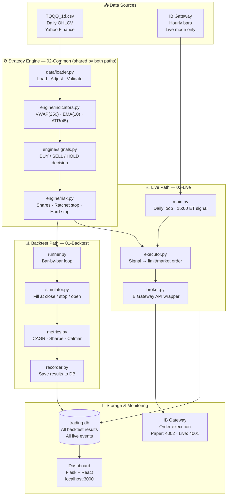

# TQQQ Momentum Strategy — Documentation Hub

> **Strategy:** VWAP(250) + EMA(10) + ATR(45) ratcheting momentum — Long & Short
> **Symbol:** TQQQ (3× leveraged NASDAQ 100 ETF)
> **Execution:** Daily signals · Live via Interactive Brokers Gateway
> **Status:** Phase 3 Complete — Paper trading ready

---

## Who Should Read What

| Your role | Start here | Then read |
|-----------|-----------|-----------|
| **New team member** | [Setup & Deployment](Setup-Deployment) | [System Architecture](System-Architecture) → [Strategy Logic](Strategy-Logic) |
| **Quant researcher** | [Strategy Logic](Strategy-Logic) | [Backtest Engine](Backtest-Engine) → [Experiment Results](Experiment-Results) |
| **Live trading operator** | [IB Control & Operations](IB-Control-Operations) | [System Monitoring Guide](System-Monitoring-Guide) → [Dashboard Guide](Dashboard-Guide) |
| **Stakeholder / PM** | This page | [Performance Metrics Guide](Performance-Metrics-Guide) → [Experiment Results](Experiment-Results) |
| **Developer** | [System Architecture](System-Architecture) | [Ref-Engine-Core](Ref-Engine-Core) → [Ref-Data-Backtest](Ref-Data-Backtest) |
| **Debugging an issue** | [Troubleshooting Playbook](Troubleshooting-Playbook) | [Session Log Reference](Session-Log-Reference) |

---

## 2-Minute System Summary

**What it does:** Every trading day at 15:00 ET, the system checks three things about TQQQ's price:

1. Is today's close **above** the 250-day volume-weighted average price? → [VWAP(250)](Strategy-Logic#vwap-250)
2. Is today's close **above** the 10-day exponential moving average? → [EMA(10)](Strategy-Logic#ema-10)
3. How far has TQQQ moved on average over 45 days? → [ATR(45)](Strategy-Logic#atr-45) — used to set the stop distance

If both (1) and (2) are true → **BUY LONG.** If both are false → **SELL SHORT.** Otherwise → **HOLD.**

Once in a trade, a [ratchet stop](Glossary#ratchet-stop) trails the price. The stop only ever moves *in your favour* — it locks in gains and never loosens. A [hard stop](Glossary#hard-stop) acts as a safety floor.

**Three operating modes:**

| Mode | What it does | Uses real money? | Entry point |
|------|-------------|-----------------|-------------|
| **Backtest** | Replay strategy on 15 years of historical data | No | `python 01-Backtest/backtest/run.py` |
| **Paper** | Full live loop, simulated orders via IB Gateway | No | `python 03-Live/live/main.py` |
| **Live** | Real orders via Interactive Brokers | **Yes** | Same as paper, different port |

---

## System Context Diagram

> **How to read:** Follow the arrows — they show how data moves from a raw CSV file to a trade order or database record. Boxes in green are the strategy engine (shared by both backtest and live). Blue is storage.



---

## Wiki Navigation — All 30 Pages

### 🏠 Foundation

| Page | Audience | What it covers |
|------|----------|---------------|
| **You are here** | Everyone | Navigation, summary, status |
| [System Architecture](System-Architecture) | Everyone | Module map, import rules, deployment modes |
| [Strategy Logic](Strategy-Logic) | Everyone | VWAP+EMA+ATR, ratchet stop, position sizing |
| [Impact Matrix](Impact-Matrix) | Everyone | What breaks if X changes — cascade & severity |
| [Glossary](Glossary) | Everyone | Every domain term defined with formula & file ref |
| [Setup & Deployment](Setup-Deployment) | Developers | New machine setup, venv, first run |

### 📊 Backtest & Research

| Page | Audience | What it covers |
|------|----------|---------------|
| [Backtest Engine](Backtest-Engine) | Everyone | Simulation loop, fill logic v0.6.7, how to run |
| [Performance Metrics Guide](Performance-Metrics-Guide) | Everyone | How to interpret CAGR, Calmar, Sharpe, R-multiple |
| [Engine Core Functions](Ref-Engine-Core) | Developers | All functions: config · indicators · signals · risk |
| [Data & Backtest Functions](Ref-Data-Backtest) | Developers | All functions: loader · runner · simulator · metrics · recorder |
| [Experiment Results](Experiment-Results) | Everyone | All experiments — hypothesis, result, verdict |
| [Data Windows Reference](Data-Windows-Reference) | Researchers | All 18 windows — dates, regime, warmup rules |
| [Batch Operations](Batch-Operations) | Developers | All scripts & `.bat` files — usage, sequence, output |
| [Testing Guide](Testing-Guide) | Developers | Test structure, coverage, fixtures, safety gates |
| [YAML Config Guide](YAML-Config-Guide) | Developers | All YAML/JSON config files, inheritance, new experiments |
| [Config Reference](Config-Reference) | Everyone | Every `config.yaml` + `.env` param — default, range, impact |
| [Data Management](Data-Management) | Developers | Data pipeline, CSV update, backfill, quality checks |

### 📈 Live Trading & Dashboard

| Page | Audience | What it covers |
|------|----------|---------------|
| [Live Trading Engine](Live-Trading-Engine) | Everyone | Daily loop, startup, stop monitoring, safety invariants |
| [IB Gateway Integration](IB-Gateway-Integration) | Developers | Connection architecture, order flow, safety design |
| [IB Control & Operations](IB-Control-Operations) | Operators | Step-by-step start/stop, commands, troubleshoot, emergency |
| [System Monitoring Guide](System-Monitoring-Guide) | Operators | Circuit breaker, heartbeat, logs, how to intervene |
| [Dashboard Guide](Dashboard-Guide) | Operators | All screens, every UI element, interactions, API mapping |
| [Live Trading Functions](Ref-Live-Trading) | Developers | All functions: main · executor · strategy · cb · logger · db |
| [IB Broker Functions](Ref-IB-Broker) | Developers | All functions: broker · data · validate · lock · process_manager |
| [Database Schema](Database-Schema) | Developers | Every table, column, FK relationships, sample queries |
| [Session Log Reference](Session-Log-Reference) | Operators | Event types, log levels, all log tables, how to query |
| [Troubleshooting Playbook](Troubleshooting-Playbook) | Operators | Common errors with resolution steps, recovery |
| [Backup & Recovery](Backup-Recovery) | Operators | backup.py usage, Google Drive, restore procedure |

---

## Key Performance Results

Best configuration: **exp\_018\_atr\_wider** — `VWAP=250 · EMA=10 · ATR=45 · mult=5.0 · hs=11% · vol_sizing=ON · CB=30%`

| Window | Period | CAGR | Max DD | Calmar | Trades | vs Buy & Hold |
|--------|--------|------|--------|--------|--------|--------------|
| Rolling 5Y | 2021–2026 | **45.8%** | -28.2% | **1.63** ✅ | 27 | +19.4pp CAGR |
| Full Cycle 2 | 2017–2026 | **40.4%** | -53.7% | 0.75 ❌ | 48 | +1.8pp CAGR |
| Bear Year 2022 | 2021–2023 | **33.6%** | -18.3% | **1.83** | 7 | +84.7pp CAGR |
| Rolling 3Y | 2023–2026 | 38.4% | -28.2% | 1.36 | 16 | — |
| Buy & Hold (ref) | 2021–2026 | 26.4% | -81.7% | 0.32 | 1 | baseline |

> **Phase 2 target:** Calmar > 1.0 on BOTH Rolling 5Y AND Full Cycle 2. Rolling 5Y: ✅ achieved (1.63). Full Cycle 2: ❌ not met (0.75). Best config deployed to live regardless.
> Full details: [Experiment Results](Experiment-Results) · Metric definitions: [Performance Metrics Guide](Performance-Metrics-Guide)

---

## Current Phase Status

| Phase | Status | Key deliverable | Version |
|-------|--------|----------------|---------|
| Phase 1 — Backtest System | ✅ Complete | 159 tests passing · 18-window dataset | v0.3.7 |
| Phase 2 — Strategy Optimization | ✅ Complete | Best config: exp_018 · Fill logic v0.6.7 | v0.6.7 |
| Phase 3 — Live Infrastructure | ✅ Complete | Paper trading ready · 45 tests passing | v0.7.16 |
| Phase 4 — Live Trading | 🔄 Pending | Connect paper TWS · run first session | — |

**Immediate next steps (Phase 4):**
1. Start IB Gateway on port 4002 (paper) → [IB Control & Operations](IB-Control-Operations#starting-ib-gateway)
2. Run `run_readiness_check()` → verify all 5 checks pass → [IB Gateway Integration](IB-Gateway-Integration#readiness-checks)
3. Run `backfill_hourly_db()` → populate TQQQ_1h with 5-year history → [Data Management](Data-Management#backfill-hourly-data)
4. First paper session → monitor [Dashboard](Dashboard-Guide) → review [Session Log](Session-Log-Reference)

---

## Fill Logic — Critical History

The backtest fill logic went through two bug-fix cycles. **All results in this wiki use v0.6.7 (final, correct).**

| Version | Bug | Impact on results |
|---------|-----|------------------|
| Pre-v0.6.6 | `fill_exit()` used bar close even when price recovered above stop | CAGR inflated by 10–15pp |
| v0.6.6 | Gap-down opens still filled at close instead of open | CAGR slightly pessimistic |
| **v0.6.7 (current)** | Gap-aware: open ≤ stop → fill at open; intraday touch → fill at stop | **Correct** |

> Full history: see `docs/fill_exit_bug_history.md` in the repo · Technical detail: [Backtest Engine — Fill Logic](Backtest-Engine#fill-logic-v067)

---

## Quick Reference

```bash
# Run backtest (auto-loads config.yaml)
python 01-Backtest/backtest/run.py

# Run all experiments across all windows
python 01-Backtest/scripts/run_all_windows.py --windows all

# Run all tests
pytest

# Start live/paper trading loop
python 03-Live/live/main.py

# Start dashboard
cd 03-Live/gui && python app.py          # Flask backend  localhost:5000
cd 03-Live/gui/frontend && npm start     # React frontend localhost:3000

# Create backup snapshot
python backup.py my_label
```

> Detailed usage: [Batch Operations](Batch-Operations) · [Setup & Deployment](Setup-Deployment) · [IB Control & Operations](IB-Control-Operations)
