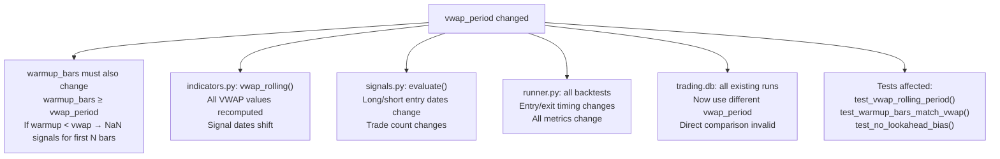
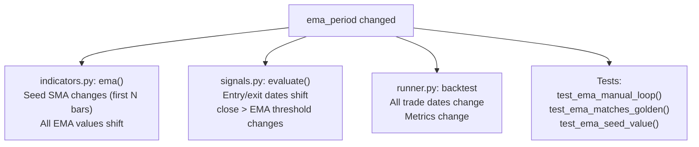
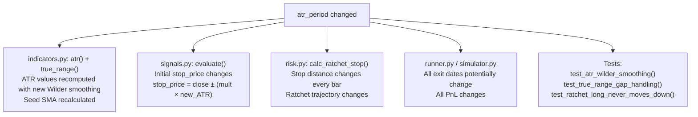
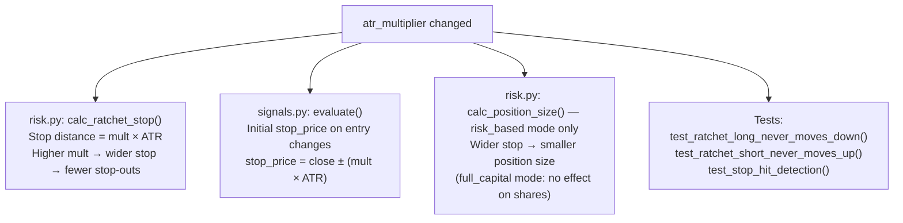
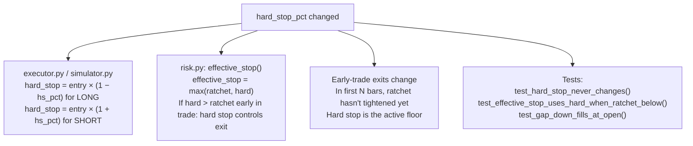
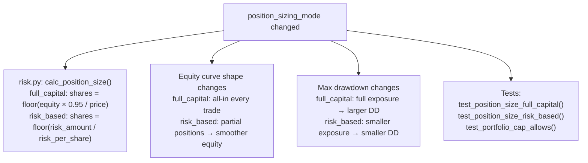
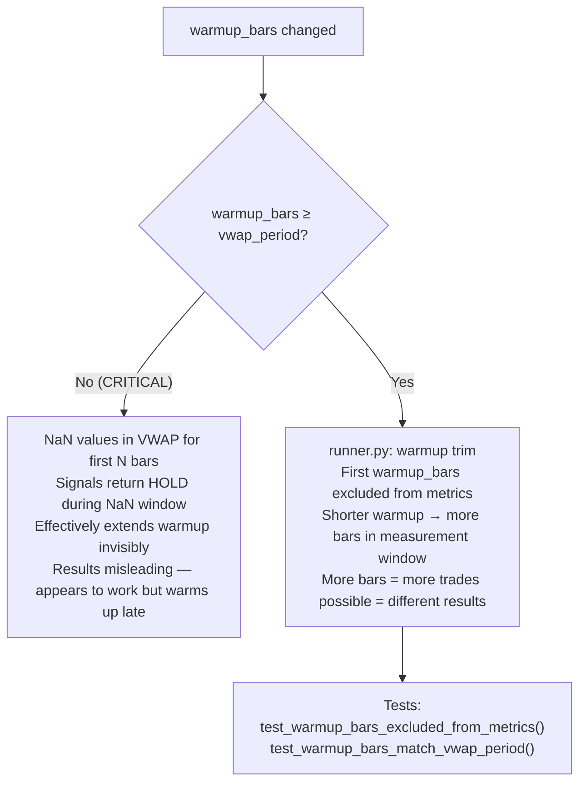
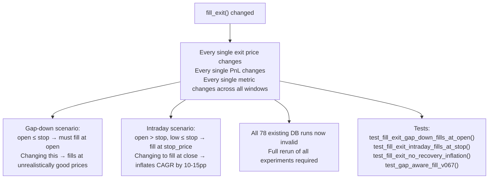
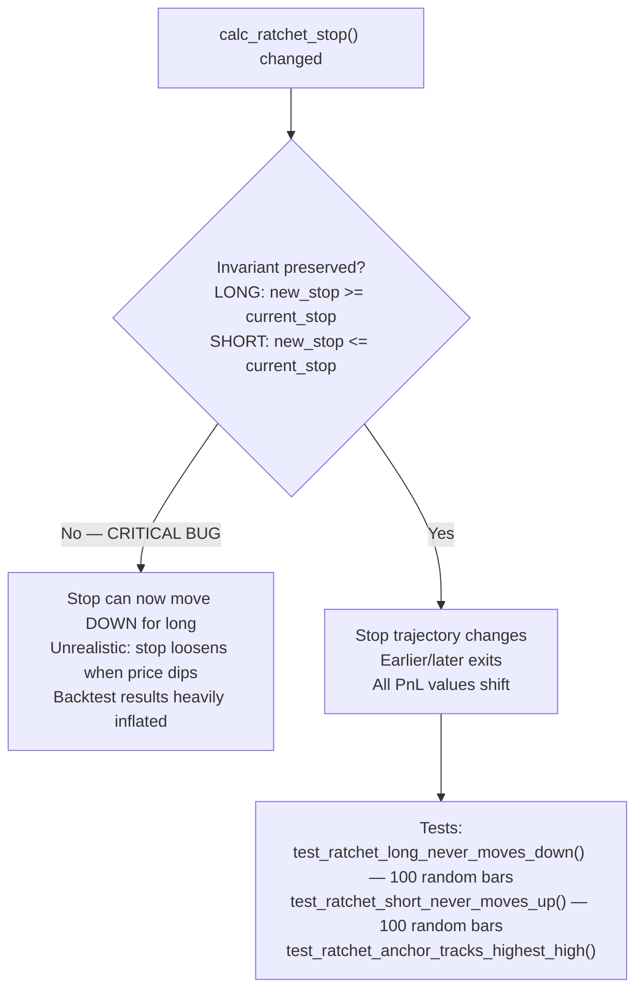
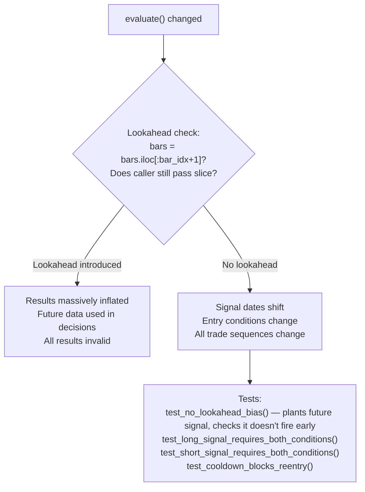

# Impact Matrix

> **Plain English:** This page answers the question every developer asks before touching the code: *"If I change X, what breaks?"* Each section covers one configurable parameter or code component, lists every downstream effect, assigns a severity, and links to the tests that must pass before committing.

**Related pages:** [Strategy Logic](Strategy-Logic) · [Config Reference](Config-Reference) · [Testing Guide](Testing-Guide) · [Ref-Engine-Core](Ref-Engine-Core)

---

## How to Use This Page

1. Find the parameter or component you intend to change in the table of contents
2. Read the **cascade** — every system that is affected
3. Check the **severity** — how badly results will change
4. Run the listed **tests** before committing
5. Re-run all affected **experiments** to verify no regression

### Severity Scale

| Symbol | Level | Meaning |
|--------|-------|---------|
| 🔴 | **CRITICAL** | Results change materially; all experiments must be re-run; likely invalidates existing DB records |
| 🟠 | **HIGH** | Significant impact on performance metrics; key experiments must be re-run |
| 🟡 | **MEDIUM** | Moderate impact; affected window results should be re-verified |
| 🟢 | **LOW** | Minor or cosmetic impact; unit tests sufficient |

---

## Table of Contents

**Strategy Parameters**
1. [VWAP Period](#vwap-period)
2. [EMA Period](#ema-period)
3. [ATR Period](#atr-period)
4. [ATR Multiplier](#atr-multiplier)
5. [Hard Stop Percentage](#hard-stop-pct)
6. [Position Sizing Mode](#position-sizing-mode)
7. [Allow Short](#allow-short)
8. [Warmup Bars](#warmup-bars)
9. [Cooldown Bars](#cooldown-bars)
10. [Cash Rate Annual](#cash-rate-annual)

**Code Components**
11. [fill\_exit() Logic](#fill_exit-logic)
12. [calc\_ratchet\_stop() Logic](#calc_ratchet_stop-logic)
13. [evaluate() — Signal Logic](#evaluate-signal-logic)
14. [apply\_adjustment() — Price Adjustment](#apply_adjustment-logic)
15. [EMA Implementation (manual loop)](#ema-implementation)
16. [Circuit Breaker Thresholds](#circuit-breaker-thresholds)
17. [Database Schema Changes](#database-schema-changes)

---

## VWAP Period

**Config key:** `indicators.vwap_period` · **Current value:** `250` · **Tested alternatives:** 150, 200, 300, 350 (all inferior — see [exp_007](Experiment-Results#exp_007_vwap_period))

### Cascade

| Effect | Severity | Detail |
|--------|----------|--------|
| warmup_bars must be updated to match | 🔴 CRITICAL | `warmup_bars < vwap_period` → NaN propagation → all signals become HOLD |
| All signal dates shift | 🔴 CRITICAL | Different period = different trend anchor = completely different trades |
| All existing DB results invalidated for comparison | 🟠 HIGH | Cannot compare old runs against new vwap_period runs |
| Backtest re-run on all 18 windows required | 🟠 HIGH | — |
| GUI equity curves shift | 🟡 MEDIUM | Different entry/exit dates → different equity curve shape |

**Tests to run:** `pytest 02-Common/tests/unit/test_indicators.py -k vwap`
**Experiments to re-run:** All 18 windows for any affected experiment YAML

> **Recommendation:** Do not change. Tested exhaustively in [exp_007](Experiment-Results#exp_007_vwap_period). 250 is optimal. If experimenting, create a new experiment YAML rather than changing `config.yaml`.

---

## EMA Period

**Config key:** `indicators.ema_period` · **Current value:** `10` · **Tested alternatives:** 5, 8, 15, 20 (all inferior — see [exp_004](Experiment-Results#exp_004_ema_period))

### Cascade

| Effect | Severity | Detail |
|--------|----------|--------|
| All EMA values recomputed | 🔴 CRITICAL | Every signal date potentially changes |
| Trade count changes | 🟠 HIGH | Shorter period = more reactive = more trades; longer = fewer |
| Metrics change on all windows | 🟠 HIGH | Re-run required on key windows |
| Warmup bars: no change needed | 🟢 LOW | EMA(10) warms up in 10 bars — well within warmup_bars=250 |

**Tests to run:** `pytest 02-Common/tests/unit/test_indicators.py -k ema`
**Experiments to re-run:** rolling_5y, full_cycle_2 at minimum

> **Recommendation:** Do not change. EMA(10) is optimal per exp_004. Changing shifts every trade date.

---

## ATR Period

**Config key:** `indicators.atr_period` · **Current value:** `45` · **Tested alternatives:** None (ATR period not swept; multiplier was swept instead)

### Cascade

| Effect | Severity | Detail |
|--------|----------|--------|
| Stop distance changes on every bar | 🔴 CRITICAL | Shorter ATR period = more reactive stops = more stop-outs; longer = wider stops |
| All exit dates shift | 🔴 CRITICAL | Different ATR → different stop trigger → different trade sequence |
| Warmup lengthens if atr_period > 250 | 🟠 HIGH | Would require warmup_bars update (current ATR(45) warms in 45 bars) |
| All metrics change | 🟠 HIGH | Full re-run required |

**Tests to run:** `pytest 02-Common/tests/unit/test_indicators.py -k atr`
**Experiments to re-run:** All windows — ATR affects every single stop calculation

> **Warning:** ATR period and ATR multiplier interact. Changing ATR period without re-sweeping multiplier may produce worse results than baseline.

---

## ATR Multiplier

**Config key:** `symbols[].atr_multiplier` · **Current value:** `5.0` (exp_018) / `4.5` (baseline) · **Tested values:** 3.0, 3.5, 4.0, 4.5, 5.0 — see [exp_002](Experiment-Results#exp_002_atr_multiplier)

### Cascade

| Effect | Severity | Detail |
|--------|----------|--------|
| All ratchet stop distances change | 🔴 CRITICAL | Directly changes every stop trigger date and exit price |
| Trade count changes | 🟠 HIGH | Higher mult → stops further away → fewer stop-outs → longer trades |
| Drawdown changes | 🟠 HIGH | Wider stops allow larger intraday swings → deeper drawdowns |
| Calmar ratio changes | 🟠 HIGH | CAGR and DD both shift; net effect on Calmar depends on market regime |
| Position size (full_capital mode) | 🟢 LOW | No effect — full_capital ignores stop distance for sizing |
| Position size (risk_based mode) | 🟡 MEDIUM | Wider stop → fewer shares per trade |

**Tests to run:** `pytest 02-Common/tests/unit/test_risk.py`
**Experiments to re-run:** rolling_5y, full_cycle_2, bear_period_5

> **Note:** exp_018 uses mult=5.0 (best Calmar). Baseline uses 4.5. The difference of 0.5× ATR is responsible for ~3pp Calmar improvement on rolling_5y.

---

## Hard Stop Percentage

**Config key:** `symbols[].hard_stop_pct` · **Current value:** `0.11` (exp_018) / `0.08` (baseline) · **Tested values:** 5%, 6%, 8%, 10%, 11%, 12% — see [exp_006](Experiment-Results#exp_006_hard_stop)

### Cascade

| Effect | Severity | Detail |
|--------|----------|--------|
| Early-trade exit price changes | 🟠 HIGH | Hard stop is floor for first ~5-10 bars before ratchet takes over |
| Large gap-down scenarios change | 🟠 HIGH | Hard stop catches gaps the ratchet hasn't tightened to yet |
| Long-term trades: minimal | 🟢 LOW | Once ratchet > hard_stop, hard_stop is irrelevant |
| Position size (risk_based mode) | 🟡 MEDIUM | Tighter hard_stop → more shares (narrower risk range) |

**Tests to run:** `pytest 02-Common/tests/unit/test_risk.py -k hard_stop`
**Experiments to re-run:** rolling_5y, bear_period_5 (gap-heavy windows)

---

## Position Sizing Mode

**Config key:** `risk.position_sizing_mode` · **Current value:** `full_capital` · **Alternative:** `risk_based`

### Cascade

| Effect | Severity | Detail |
|--------|----------|--------|
| Shares per trade changes completely | 🔴 CRITICAL | full_capital: ~2,714 shares; risk_based at 1%: ~259 shares |
| CAGR changes dramatically | 🔴 CRITICAL | full_capital magnifies gains AND losses vs risk_based |
| Max drawdown changes | 🔴 CRITICAL | full_capital draws deeper; risk_based absorbs losses gradually |
| Calmar ratio — net effect unclear | 🟠 HIGH | Both CAGR and DD change; must re-run to verify net Calmar |
| All existing results invalidated | 🟠 HIGH | Cannot compare full_capital runs to risk_based runs |

**Tests to run:** `pytest 02-Common/tests/unit/test_risk.py`
**Experiments to re-run:** All windows — fundamental strategy change

> **Warning:** This is the single most impactful parameter change possible. Switching from `full_capital` to `risk_based` will reduce CAGR by roughly 60–70% but also reduce drawdown. Not recommended without full experimental sweep.

---

## Allow Short

**Config key:** `symbols[].allow_short` · **Current value:** `true`

### Cascade

| Effect | Severity | Detail |
|--------|----------|--------|
| Trade count approximately halved | 🟠 HIGH | ~50% of trades are short entries |
| CAGR decreases in bear periods | 🟠 HIGH | Short trades are profitable when TQQQ falls — disabling eliminates that alpha |
| Drawdown profile changes | 🟡 MEDIUM | In bear markets: no short = idle cash → less drawdown but also less return |
| VWAP/EMA logic: no change | 🟢 LOW | Signal evaluation still runs; SHORT branch simply returns HOLD |
| IB margin requirements: change | 🟡 MEDIUM | Live short positions require margin; disabling simplifies account requirements |

**Tests to run:** `pytest 02-Common/tests/unit/test_signals.py -k short`
**Experiments to re-run:** bear_period_3, bear_period_4, bear_period_5

---

## Warmup Bars

**Config key:** `backtest.warmup_bars` · **Current value:** `250` · **Rule:** Must equal or exceed `vwap_period`

### Cascade

| Effect | Severity | Detail |
|--------|----------|--------|
| warmup_bars < vwap_period → silent NaN bug | 🔴 CRITICAL | VWAP returns NaN; signals silently hold; first trades delayed |
| Measurement window size changes | 🟠 HIGH | More warmup bars = fewer measurement bars = potentially fewer trades |
| Results change across all windows | 🟠 HIGH | Full re-run required |

**Tests to run:** `pytest 02-Common/tests/unit/ -k warmup`

> **Rule:** `warmup_bars` must always equal `vwap_period` (currently both 250). Change both together or neither.

---

## Cooldown Bars

**Config key:** `timing.cooldown_bars` · **Current value:** `1`

| Effect | Severity | Detail |
|--------|----------|--------|
| Trade frequency changes | 🟡 MEDIUM | More cooldown bars → fewer re-entries after stop-outs |
| Whipsaw protection changes | 🟡 MEDIUM | cooldown=0 allows immediate re-entry on same signal → more whipsaws |
| Metrics change modestly | 🟡 MEDIUM | Affects total trade count and time_in_market_pct |
| Signal logic: no change | 🟢 LOW | evaluate() is unchanged; cooldown_counter is managed by runner.py |

**Tests to run:** `pytest 01-Backtest/tests/unit/ -k cooldown`

---

## Cash Rate Annual

**Config key:** `risk.cash_rate_annual` · **Current value:** `0.03` (3%)

| Effect | Severity | Detail |
|--------|----------|--------|
| Combined CAGR changes slightly | 🟡 MEDIUM | Higher cash_rate → higher combined CAGR on low-trade strategies |
| Trading CAGR: unchanged | 🟢 LOW | Cash contribution is added post-simulation |
| Impact largest on low-trade strategies | 🟡 MEDIUM | B1 (buy & hold) has 100% time in market so zero idle cash |
| Dashboard display changes | 🟢 LOW | cash_contribution_pct column in runs table shifts |

**Tests to run:** `pytest 01-Backtest/tests/unit/test_metrics.py -k cash`

> **Note:** Cash rate represents idle capital earning a T-bill equivalent return. 3% is conservative (actual T-bill rate varies). Not a strategic parameter — reflects economic assumption only.

---

## fill\_exit() Logic

**File:** `01-Backtest/backtest/simulator.py` · **Function:** [`fill_exit()`](Ref-Data-Backtest#fill_exit)

> This is the highest-risk function in the codebase. Two bugs were found and fixed here (v0.6.6, v0.6.7). Any change can silently introduce lookahead bias or unrealistic fills that inflate backtest performance.

### Cascade

| Effect | Severity | Detail |
|--------|----------|--------|
| Every exit price changes | 🔴 CRITICAL | Even a 1-line change can shift CAGR by 10–15pp |
| Gap-down logic broken | 🔴 CRITICAL | If `open ≤ stop` check removed → fills at close → inflated results |
| All DB results invalidated | 🔴 CRITICAL | Must re-run all 78 experiments |
| Regression test fails | 🔴 CRITICAL | `test_regression.py` compares against golden result |

**Tests to run:** `pytest 01-Backtest/tests/ -k fill_exit`
**Must also run:** `pytest 01-Backtest/tests/regression/`

> **See also:** `docs/fill_exit_bug_history.md` for the full v0.6.6/v0.6.7 incident history.

---

## calc\_ratchet\_stop() Logic

**File:** `02-Common/engine/risk.py` · **Function:** [`calc_ratchet_stop()`](Ref-Engine-Core#calc_ratchet_stop)

> The ratchet invariant (stop never moves against position) is enforced here. Any change that breaks the `MAX()` / `MIN()` guarantee destroys the core risk management property.

### Cascade

| Effect | Severity | Detail |
|--------|----------|--------|
| Invariant broken (stop moves down) | 🔴 CRITICAL | Core risk management destroyed; results heavily inflated |
| Anchor tracking changed | 🔴 CRITICAL | `highest_high` must be running max since entry, never reset |
| Exit timing shifts | 🟠 HIGH | Even small changes to the formula shift every exit date |

**Tests to run:** `pytest 02-Common/tests/unit/test_risk.py -k ratchet`

> **Golden rule:** After any change to `calc_ratchet_stop()`, run `test_ratchet_long_never_moves_down()` first. It generates 100 random bar sequences and verifies the invariant on every one. If this test fails, the change is invalid.

---

## evaluate() — Signal Logic

**File:** `02-Common/engine/signals.py` · **Function:** [`evaluate()`](Ref-Engine-Core#evaluate)

### Cascade

| Effect | Severity | Detail |
|--------|----------|--------|
| Lookahead bias introduced | 🔴 CRITICAL | Results can show 100%+ CAGR but are completely fabricated |
| Signal conditions changed | 🟠 HIGH | Changing from AND to OR logic doubles trade frequency |
| warmup check removed | 🟠 HIGH | Signals fire during indicator warm-up → unreliable early trades |

**Tests to run:** `pytest 02-Common/tests/unit/test_signals.py`
**Critical test:** `test_no_lookahead_bias()` — must always pass

---

## apply\_adjustment() — Price Adjustment

**File:** `02-Common/data/loader.py` · **Function:** [`apply_adjustment()`](Ref-Data-Backtest#apply_adjustment)

| Effect | Severity | Detail |
|--------|----------|--------|
| Factor formula changed | 🔴 CRITICAL | All OHLC values change → all indicators change → all signals change |
| Zero-close guard removed | 🟠 HIGH | Division by zero crash on split dates |
| Volume not adjusted | 🟢 LOW | Volume is not adjusted (intentional — raw volume for VWAP weighting) |
| Live vs backtest mismatch | 🟠 HIGH | If backtest uses adjusted prices but live uses different adjustment → signal mismatch |

**Tests to run:** `pytest 02-Common/tests/unit/test_data.py -k adjustment`

---

## EMA Implementation

**File:** `02-Common/engine/indicators.py` · **Function:** [`ema()`](Ref-Engine-Core#ema)

> The EMA must be a manual loop. `pandas.ewm()` uses different boundary conditions and produces values that don't match the test golden values. This is a permanent architectural decision.

| Effect | Severity | Detail |
|--------|----------|--------|
| Switch to `pandas.ewm()` | 🔴 CRITICAL | Different seed value → different EMA boundary → test failures → different signals |
| Change multiplier formula | 🔴 CRITICAL | 2/(period+1) is the standard; changing it breaks all golden values |
| Seed method changed | 🟠 HIGH | Must seed with SMA of first N bars; any other seed shifts all values |

**Tests to run:** `pytest 02-Common/tests/unit/test_indicators.py -k ema`

> **Rule (from CLAUDE.md):** Never use `pandas.ewm()` for EMA. Manual loop only. This is non-negotiable.

---

## Circuit Breaker Thresholds

**File:** `03-Live/live/circuit_breaker.py` · Constants: `LEVEL_WARNING`, `LEVEL_ERROR`, `LEVEL_CRITICAL`, `LEVEL_STOP`

| Effect | Severity | Detail |
|--------|----------|--------|
| LEVEL_STOP threshold raised (e.g. 20% → 25%) | 🟠 HIGH | System tolerates larger drawdowns before emergency shutdown |
| LEVEL_STOP threshold lowered (e.g. 20% → 15%) | 🟠 HIGH | System shuts down more aggressively — may miss recoveries |
| REPEAT_INTERVAL_SECS changed | 🟡 MEDIUM | Affects frequency of CRITICAL log spam during emergency |
| Backtest circuit_breaker threshold | 🟡 MEDIUM | `backtest.max_dd_threshold` in config; controls CB in simulation |

**Tests to run:** `pytest 03-Live/tests/ -k circuit_breaker`
**Live impact:** Changes affect live session safety — must be verified in paper mode first.

---

## Database Schema Changes

**Files:** `01-Backtest/backtest/recorder.py`, `03-Live/live/db_setup.py`

| Change type | Severity | Detail |
|-------------|----------|--------|
| Add column to `runs` table | 🟡 MEDIUM | Existing rows get NULL; recorder.py must insert the new column |
| Remove column from `runs` | 🔴 CRITICAL | All existing SELECT queries that reference the column fail |
| Rename column | 🔴 CRITICAL | All queries, GUI endpoints, and API responses break |
| Add new table | 🟢 LOW | `IF NOT EXISTS` guards mean old DB still works |
| Change primary key type | 🔴 CRITICAL | Migration required; existing rows become orphaned |
| Change `equity_curve` JSON format | 🟠 HIGH | GUI equity curve charts break; all runs show empty charts |

**Tests to run:** `pytest 01-Backtest/tests/integration/`
**GUI check:** Verify `GET /api/backtest/equity-curve/{run_id}` still returns valid JSON after schema change.

---

## Full Impact Summary Table

| Parameter / Component | Severity | All results invalidated? | Tests required | Re-run experiments? |
|----------------------|----------|------------------------|---------------|-------------------|
| `vwap_period` | 🔴 CRITICAL | Yes | test_indicators, test_signals | All 18 windows |
| `ema_period` | 🔴 CRITICAL | Yes | test_indicators, test_signals | All 18 windows |
| `atr_period` | 🔴 CRITICAL | Yes | test_indicators, test_risk | All 18 windows |
| `atr_multiplier` | 🔴 CRITICAL | Yes | test_risk | rolling_5y, full_cycle_2 |
| `hard_stop_pct` | 🟠 HIGH | Partial | test_risk | rolling_5y, bear windows |
| `position_sizing_mode` | 🔴 CRITICAL | Yes | test_risk | All 18 windows |
| `allow_short` | 🟠 HIGH | Partial | test_signals | Bear period windows |
| `warmup_bars` | 🟠 HIGH | Partial | test_indicators | All affected windows |
| `cooldown_bars` | 🟡 MEDIUM | No | test_signals | Key windows |
| `cash_rate_annual` | 🟡 MEDIUM | No | test_metrics | None required |
| `fill_exit()` logic | 🔴 CRITICAL | Yes (all 78 runs) | test_backtest, regression | All 18 windows |
| `calc_ratchet_stop()` | 🔴 CRITICAL | Yes | test_risk | All 18 windows |
| `evaluate()` signal logic | 🔴 CRITICAL | Yes | test_signals | All 18 windows |
| `apply_adjustment()` | 🔴 CRITICAL | Yes | test_data | All 18 windows |
| EMA manual loop | 🔴 CRITICAL | Yes | test_indicators | All 18 windows |
| Circuit breaker thresholds | 🟠 HIGH | No (live only) | test_live (paper first) | Paper session |
| DB schema | Varies | Depends on change | test_integration | None (structural) |
