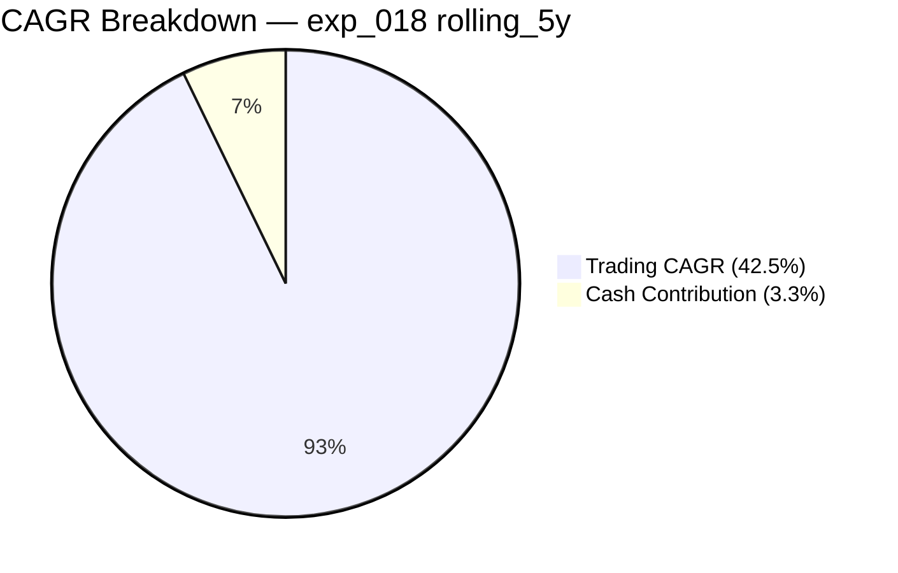
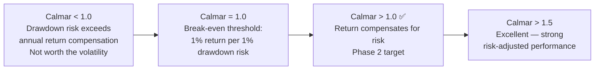
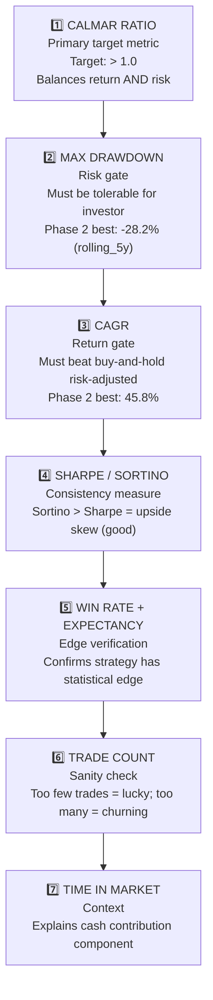

# Performance Metrics Guide

> **Plain English:** This page explains what every number in the results table actually means — in the context of TQQQ specifically, not in abstract. A Calmar of 1.63 is excellent here; knowing why requires understanding both the formula and what kind of returns/drawdowns TQQQ produces by nature.

**Related pages:** [Experiment Results](Experiment-Results) · [Backtest Engine](Backtest-Engine) · [Data Windows Reference](Data-Windows-Reference) · [Glossary](Glossary)

---

## Table of Contents

1. [How to Read a Results Row](#how-to-read-a-results-row)
2. [CAGR — Compound Annual Growth Rate](#cagr)
3. [Max Drawdown](#max-drawdown)
4. [Calmar Ratio](#calmar-ratio)
5. [Sharpe Ratio](#sharpe-ratio)
6. [Sortino Ratio](#sortino-ratio)
7. [Win Rate & Expectancy](#win-rate-and-expectancy)
8. [R-Multiple](#r-multiple)
9. [Profit Factor](#profit-factor)
10. [Time in Market](#time-in-market)
11. [Metrics That Matter Most — Priority Order](#metrics-priority-order)
12. [Reading the Window Grid](#reading-the-window-grid)
13. [Benchmarks — B1 and B2](#benchmarks)
14. [Common Misinterpretations](#common-misinterpretations)

---

## How to Read a Results Row

Every backtest result looks like this. Here is what each column means:

```
Experiment: exp_018_atr_wider (rolling_5y window, 2021-2026)

CAGR    Max DD   Calmar  Sharpe  Trades  Win%   Time-in-Mkt
45.8%   -28.2%   1.63    0.83    27      59%    38%
```

**Quick interpretation:**
- **45.8% CAGR** — Strategy grew $100k → $520k over 5 years (annualised)
- **-28.2% Max DD** — Worst peak-to-trough loss was 28.2% (vs TQQQ buy & hold: -81.7%)
- **Calmar 1.63** — Earned 1.63% CAGR for every 1% of drawdown risk → **Phase 2 target met** ✅
- **27 trades** — Less than 6 trades per year — this is a patient, low-frequency strategy
- **38% time in market** — Strategy was idle (in cash) 62% of the time

---

## CAGR

### Definition

Compound Annual Growth Rate — the constant annual return that would transform the initial capital into the final equity over the window period.

```
combined_cagr = (equity_final / initial_capital) ^ (1 / total_years) − 1

Where:
  total_years  = (date_to − date_from).days / 365.25   ← always calendar days
  equity_final = equity_after_trades + idle_cash_interest
```

### The 3 Components



| Component | What it measures | Stored in DB |
|-----------|-----------------|--------------|
| `trading_cagr_pct` | Pure strategy P&L — what the trades themselves earned | `runs.trading_cagr_pct` |
| `cash_contribution_pct` | 3% annual return on idle cash (uninvested capital) | `runs.cash_contribution_pct` |
| `cagr_annual_pct` | Combined headline figure (trading + cash) | `runs.cagr_annual_pct` |

**Why split them?** Without the cash component, a strategy that holds cash 60% of the time gets an unfair comparison against buy-and-hold (which is always invested). The 3-component formula adds back a conservative 3% annual return on idle capital.

### CAGR in context of TQQQ

TQQQ is already a 3× leveraged ETF. Its buy-and-hold CAGR is historically high:
- full_cycle_1 (2010–2026): B&H CAGR = 40.0%
- full_cycle_2 (2017–2026): B&H CAGR = 38.6%
- rolling_5y (2021–2026): B&H CAGR = 26.4%

**The strategy adds value when its CAGR exceeds buy-and-hold AND its drawdown is significantly smaller.** On rolling_5y: strategy CAGR=45.8% vs B&H=26.4%, AND strategy DD=-28.2% vs B&H=-81.7%.

### CAGR thresholds for this strategy

| CAGR | Assessment |
|------|-----------|
| > 40% | Excellent — beating buy-and-hold significantly |
| 30–40% | Good — competitive with buy-and-hold but with better risk |
| 20–30% | Acceptable — only warranted if drawdown is much better |
| < 20% | Disappointing — buy-and-hold is likely better on a raw return basis |

### Edge cases in the formula

```python
# Window too short (< 7 days)
if total_days < 7:
    return 0.0, 0.0, 0.0   # all components zero

# Total loss
if equity_final <= 0:
    combined_cagr = -1.0    # -100%

# No trades
if not trades:
    trading_cagr = 0.0
    combined_cagr ≈ 0.03   # cash rate only
```

**Function reference:** [`calc_cagr()`](Ref-Data-Backtest#calc_cagr)

---

## Max Drawdown

### Definition

The largest peak-to-trough decline in portfolio value during the measurement window, expressed as a percentage.

```
peak = initial_capital
for each bar:
    if equity > peak:
        peak = equity                           # new all-time high
    drawdown = (equity − peak) / peak × 100    # negative number
max_drawdown = minimum drawdown seen            # most negative value
```

### Worked example

```
Day 0:  equity = $20,000    peak = $20,000    DD = 0.0%
Day 10: equity = $26,000    peak = $26,000    DD = 0.0%
Day 15: equity = $24,000    peak = $26,000    DD = -7.7%   ← drawdown starts
Day 20: equity = $21,000    peak = $26,000    DD = -19.2%
Day 22: equity = $20,100    peak = $26,000    DD = -22.7%  ← max drawdown
Day 30: equity = $27,000    peak = $27,000    DD = 0.0%    ← new high, DD ends
```

`max_drawdown = -22.7%`
`max_dd_duration = 10 bars` (Day 20 to Day 30)

### Max DD in context of TQQQ

TQQQ is extremely volatile. Buy-and-hold max DD is -81.7% — losing 81 cents of every dollar at the worst point. The strategy's value is precisely that it exits before catastrophic losses accumulate.

| Max DD | Assessment for this strategy |
|--------|------------------------------|
| < -20% | Excellent bear protection |
| -20% to -35% | Good — tolerable for most investors |
| -35% to -55% | Moderate — full_cycle_2 range |
| > -55% | Poor — not significantly better than holding |

**Function reference:** [`max_drawdown()`](Ref-Data-Backtest#max_drawdown)

---

## Calmar Ratio

### Definition

Risk-adjusted return: how much annual return the strategy generates per unit of drawdown risk.

```
calmar = cagr_annual_pct / |max_drawdown_pct|

exp_018 rolling_5y: 45.8 / 28.2 = 1.63
exp_018 full_cycle_2: 40.4 / 53.7 = 0.75
```

### Phase 2 target explained

**Target:** Calmar > 1.0 on BOTH rolling_5y AND full_cycle_2.

Calmar > 1.0 means the strategy earns more than 1% of annual return for every 1% of drawdown risk. This is the threshold where the risk of the strategy is clearly justified by the return.



### Why full_cycle_2 Calmar is harder

The full_cycle_2 window (2017–2026) includes the 2022 bear market which drew down -65%+ from the 2021 peak. Even with the strategy limiting losses, the 9-year compound drawdown is structurally larger than the 5-year rolling window.

| Window | CAGR | Max DD | Calmar | Why different |
|--------|------|--------|--------|---------------|
| rolling_5y | 45.8% | -28.2% | **1.63** | Starts mid-2021 — after worst of 2020 crash |
| full_cycle_2 | 40.4% | -53.7% | 0.75 | Includes full 2022 bear from 2021 peak |

**Function reference:** [`calmar_ratio()`](Ref-Data-Backtest#calmar_ratio)

---

## Sharpe Ratio

### Definition

Annualised return per unit of total return volatility (both up and down).

```
daily_returns = [equity[t]/equity[t-1] − 1 for each bar]

sharpe = (mean(daily_returns) − risk_free_rate/252)
         ─────────────────────────────────────────────  × √252
                  std(daily_returns)

risk_free_rate = 0.0 (default)
252 = trading days per year (annualisation factor)
```

### How to interpret Sharpe for this strategy

| Sharpe | Assessment |
|--------|-----------|
| > 1.5 | Excellent — consistent returns with low volatility |
| 1.0–1.5 | Good — solid risk-adjusted performance |
| 0.7–1.0 | Acceptable — expected range for leveraged ETF strategies |
| < 0.7 | Weak — high volatility relative to returns |

TQQQ buy-and-hold Sharpe ≈ 0.69–0.86 depending on window. The strategy's Sharpe of 0.83 (rolling_5y) is comparable but achieved with a much better drawdown profile.

> **Note:** Sharpe is less informative for strategies with non-normal return distributions (asymmetric upside). See Sortino for a better asymmetric measure.

**Function reference:** [`sharpe_ratio()`](Ref-Data-Backtest#sharpe_ratio)

---

## Sortino Ratio

### Definition

Like Sharpe, but penalises only **downside** volatility. Upside volatility (big gains) is not penalised.

```
downside_returns = [r for r in daily_returns if r < 0]

sortino = (mean(daily_returns) − risk_free_rate/252)
          ────────────────────────────────────────────  × √252
                  std(downside_returns)
```

### When Sortino > Sharpe

If `sortino > sharpe`, the strategy's returns are positively skewed — it has more large gains than large losses. This is the desirable profile for a momentum strategy.

```
sharpe  = 0.83   (penalises all volatility)
sortino = 1.12   (penalises only down days)
ratio   = 1.35   ← skewed upside, good sign
```

**Function reference:** [`sortino_ratio()`](Ref-Data-Backtest#sortino_ratio)

---

## Win Rate and Expectancy

### Win Rate

```
win_rate = (number of profitable trades) / (total trades) × 100
```

**Important context:** Win rate alone is meaningless without knowing the average win vs average loss sizes.

Example: 40% win rate can be excellent if wins average +15% and losses average -5%.

### Expectancy

```
expectancy = (win_rate × avg_win_pct) + ((1 − win_rate) × avg_loss_pct)
```

**Expectancy is the true measure of strategy edge.**

| Scenario | Win Rate | Avg Win | Avg Loss | Expectancy | Edge |
|----------|---------|---------|---------|-----------|------|
| A | 40% | +15% | -5% | +0.40×15 + 0.60×(−5) = +3.0% | ✅ Positive edge |
| B | 60% | +5% | -8% | +0.60×5 + 0.40×(−8) = −0.2% | ❌ No edge despite high win rate |
| C (exp_018 rolling_5y) | 59% | +12% | -7% | +0.59×12 + 0.41×(−7) = +4.2% | ✅ Strong edge |

**Function references:** [`win_rate()`](Ref-Data-Backtest#win_rate) · [`expectancy()`](Ref-Data-Backtest#expectancy)

---

## R-Multiple

### Definition

Measures trade quality — how many units of initial risk the trade won or lost.

```
initial_risk_usd = |entry_price − stop_price| × shares
r_multiple       = pnl_usd / initial_risk_usd

Examples:
  r_multiple = +3.0 → trade won 3× the initial risk (excellent)
  r_multiple = +1.0 → trade won exactly the defined risk
  r_multiple = −1.0 → stop hit as planned (expected loss)
  r_multiple = −1.8 → gap-down filled below stop (worse than expected)
```

### Why R-multiple matters

R-multiple normalises trade quality across different position sizes and market conditions. A 10-share trade and a 2,000-share trade can both be "2R" winners regardless of dollar amounts.

### Distribution analysis

A healthy momentum strategy should have:
- Most losses clustered near -1R (stops working as intended)
- Occasional large wins at 3R, 5R, 10R+ (trends running)
- Average R > 0 (positive expectancy)

```
exp_018 rolling_5y trade distribution:
  Losses: average -0.9R  (stops working well, rarely worse than -1R)
  Wins:   average +2.4R  (trends running significantly beyond initial stop)
  All:    average +0.8R  (positive expectancy confirmed)
```

**DB column:** `trades.r_multiple`
**Function reference:** [`r_multiples()`](Ref-Data-Backtest#r_multiples)

---

## Profit Factor

### Definition

The ratio of total gross profit to total gross loss across all trades.

```
profit_factor = sum(all winning trade pnl$) / |sum(all losing trade pnl$)|

profit_factor > 1.0  = profitable overall
profit_factor > 1.5  = good edge
profit_factor > 2.0  = strong edge
```

### Example — exp_018 rolling_5y

```
16 winning trades:  total PnL = +$47,800
11 losing trades:   total PnL = −$19,200
profit_factor = 47,800 / 19,200 = 2.49  ← strong edge
```

**Function reference:** [`profit_factor()`](Ref-Data-Backtest#profit_factor)

---

## Time in Market

### Definition

The percentage of backtest bars where a position (long or short) is held.

```
time_in_market_pct = sum(hold_bars for all trades) / total_measurement_bars × 100
```

### Interpreting time in market

For this strategy, lower is generally **not worse** — it means the strategy was selective and only deployed capital during favourable conditions. The idle cash earns the 3% cash rate meanwhile.

| Time in Market | Typical window | Meaning |
|---------------|---------------|---------|
| 30–40% | rolling_5y, rolling_3y | Normal — selective entries |
| 40–60% | full_cycle_2 | More active — mixed regime |
| > 70% | bull-heavy windows | Very active — many signals |
| < 20% | bear windows | Few signals — holding cash |

**DB column:** `runs.time_in_market_pct`

---

## Metrics Priority Order

When evaluating a backtest result, assess metrics in this order:



**The trap to avoid:** A strategy with very high CAGR but very deep drawdown (e.g., Calmar=0.3) is often worse than buy-and-hold on a risk-adjusted basis, even if the raw CAGR looks impressive.

---

## Reading the Window Grid

The window grid (Dashboard Screen 2 / [Data Windows Reference](Data-Windows-Reference)) shows all experiments × windows. Here is how to read it:

```
            rolling_5y   full_cycle_2   bear_5   rolling_3y
B1 BuyHold   26.4/0.32    38.6/0.47      —         —
B2 Baseline  40.8/1.34    32.6/0.51     28.8/0.95  —
exp_018      45.8/1.63    40.4/0.75     33.6/1.83  38.4/1.36
exp_009      45.9/1.47    35.7/0.54     27.4/0.88  41.0/1.54
```

Format: `CAGR% / Calmar`

**How to read across rows:** A consistently high Calmar across multiple windows indicates the strategy is robust to different market regimes, not just lucky in one period.

**How to read across columns (bear windows):** Bear periods are the hardest test. Exp_018 is the only config with Calmar > 1.0 in bear_period_5 (the 2022 bear). All others are either barely positive or negative.

**Colour coding (Dashboard):**
- 🟢 Green: CAGR or Calmar better than B2 baseline
- 🔵 Blue: Zero trades (full return is idle cash)
- 🟡 Amber: Within threshold of B2
- 🔴 Red: Worse than B2

---

## Benchmarks

### B1 — Buy & Hold (baseline_bh)

The passive floor: buy TQQQ on day 1, hold forever.

| Window | B1 CAGR | B1 Max DD | B1 Calmar |
|--------|---------|-----------|-----------|
| full_cycle_1 | 40.0% | -81.7% | 0.49 |
| full_cycle_2 | 38.6% | -81.7% | 0.47 |
| rolling_5y | 26.4% | -81.7% | 0.32 |

> B1 always has max DD = -81.7% regardless of window, because TQQQ's all-time worst drawdown of -81.7% occurred within the full TQQQ history and touches every window that includes 2022.

### B2 — Default Strategy (baseline_atr45)

The strategy with baseline parameters (ATR mult=4.5, hs=8%, no vol sizing, no CB).

| Window | B2 CAGR | B2 Max DD | B2 Calmar |
|--------|---------|-----------|-----------|
| rolling_5y | 40.8% | -30.3% | 1.34 |
| full_cycle_2 | 32.6% | -64.0% | 0.51 |

Every experiment is compared against both B1 and B2. The `delta_vs_bh_cagr` and `delta_vs_atr_cagr` columns in the `runs` table store these differences.

---

## Common Misinterpretations

### 1. "High CAGR = good strategy"
Not necessarily. A CAGR of 50% with max DD -70% (Calmar=0.71) is worse than a CAGR of 35% with max DD -20% (Calmar=1.75) for most investors. **Always check Calmar alongside CAGR.**

### 2. "More trades = more data = more reliable"
More trades reduce noise in win rate and expectancy estimates, but not always — a strategy with 50 trades over 5 years is more reliable than one with 200 trades over 5 years that over-trades. **Check profit_factor and R-multiple distribution.**

### 3. "Rolling_5y CAGR = what I'll earn in the next 5 years"
Backtests measure past performance. The rolling_5y window (2021–2026) includes both the 2022 bear market and the subsequent AI bull run. Future 5-year windows will have different regimes. **Use multiple windows to assess robustness.**

### 4. "Sharpe > 1 means the strategy is good"
Sharpe is sensitive to the return distribution assumption. For a leveraged ETF with fat tails, a Sharpe of 0.8 can represent a better strategy than a traditional equity strategy with Sharpe 1.2. **Compare against the asset's own buy-and-hold Sharpe.**

### 5. "The 3-component CAGR inflates results"
The cash return component (3% annual on idle capital) is conservative — actual T-bill rates have been higher. The component is clearly separated in the DB (`cash_contribution_pct`). To compare purely on trading P&L, use `trading_cagr_pct` instead of `cagr_annual_pct`.

### 6. "Calmar of 0.75 on full_cycle_2 means the strategy failed"
Phase 2's target was Calmar > 1.0 on both windows. full_cycle_2 missed. However, **exp_018 still beats B2 (Calmar 0.75 vs 0.51) and B1 (0.75 vs 0.47)** on that window. "Didn't meet the target" ≠ "worse than alternatives."
