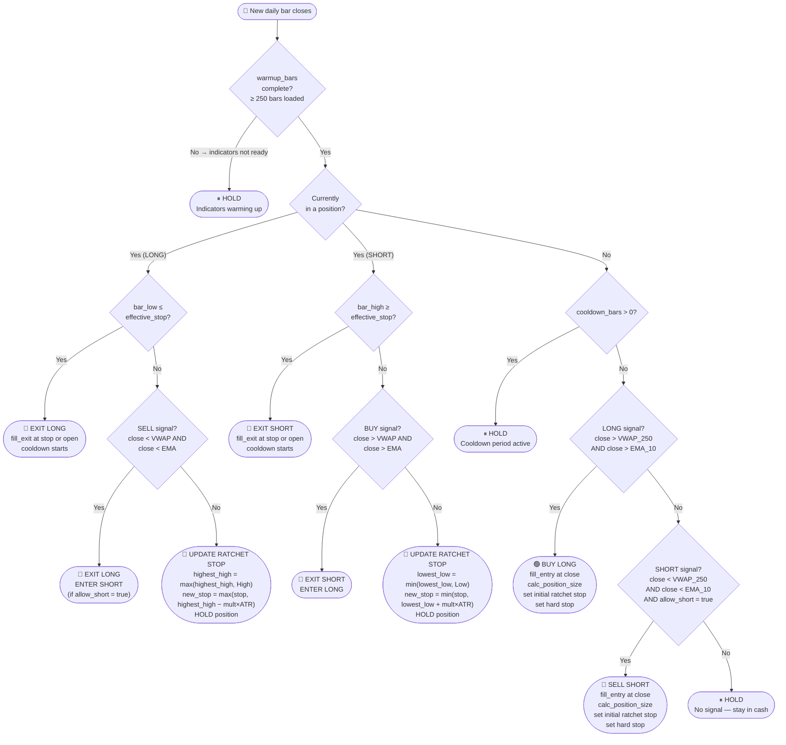
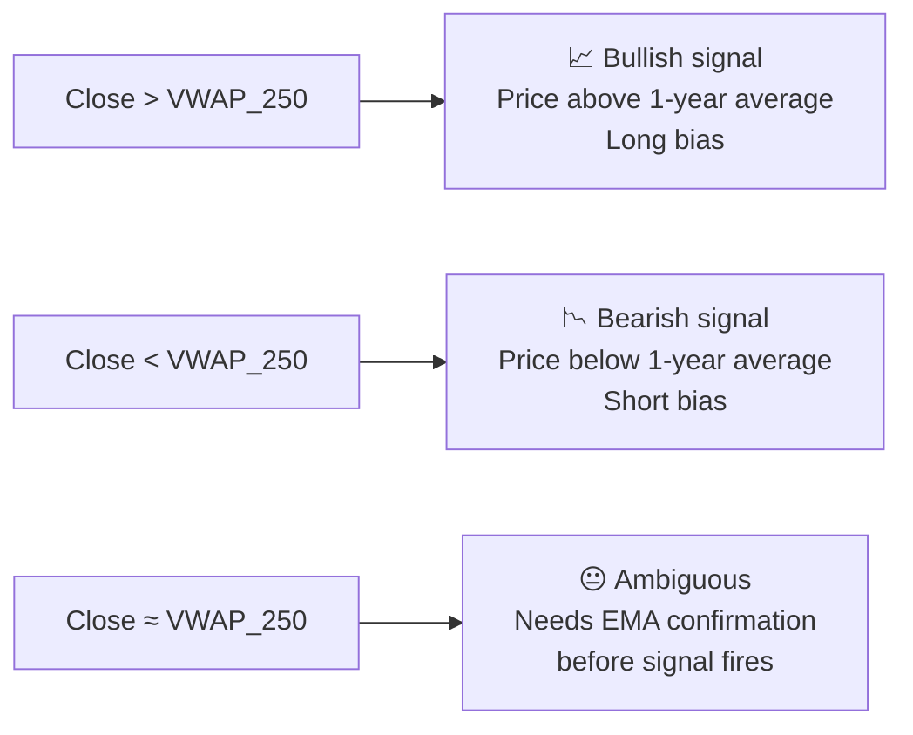
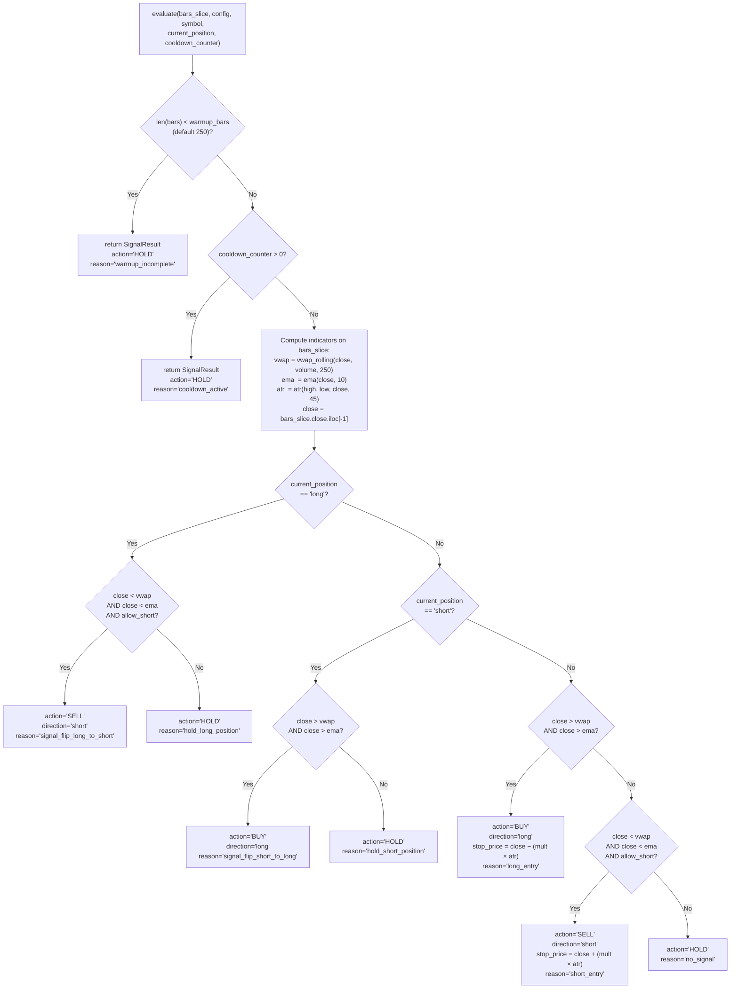
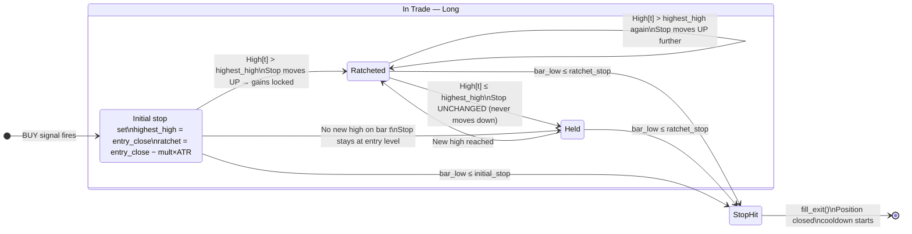
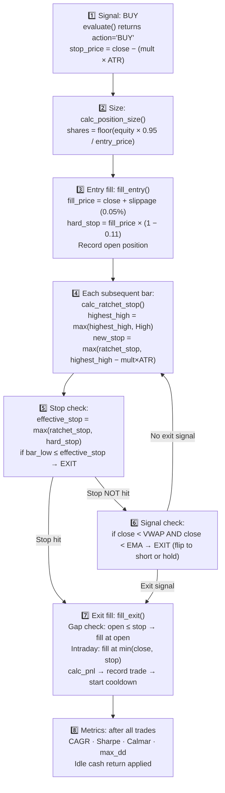
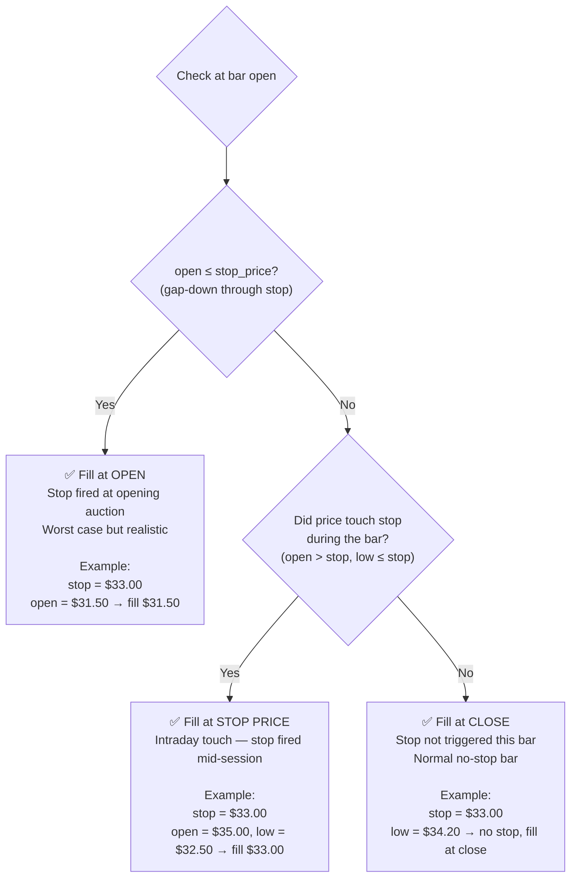

# Strategy Logic

> **Plain English:** The strategy answers one question every trading day: is TQQQ trending up, trending down, or unclear? It uses three mathematical indicators as evidence. If the trend is clearly up → buy. If clearly down → sell short. Once in a trade, a trailing stop locks in profits and exits automatically. The stop only tightens — it never loosens.

**Related pages:** [Backtest Engine](Backtest-Engine) · [Ref-Engine-Core](Ref-Engine-Core) · [Performance Metrics Guide](Performance-Metrics-Guide) · [Glossary](Glossary) · [Impact Matrix](Impact-Matrix)

---

## Table of Contents

1. [Strategy Overview](#strategy-overview)
2. [Data Preparation — Split & Dividend Adjustment](#data-preparation)
3. [Indicator 1 — VWAP(250)](#vwap-250)
4. [Indicator 2 — EMA(10)](#ema-10)
5. [Indicator 3 — ATR(45)](#atr-45)
6. [Entry Signal Logic](#entry-signal-logic)
7. [Stop Management — The Ratchet Stop](#stop-management)
8. [Hard Stop — The Safety Floor](#hard-stop)
9. [Effective Stop — Combining Both](#effective-stop)
10. [Position Sizing](#position-sizing)
11. [Cooldown & Timing Rules](#cooldown-and-timing-rules)
12. [Trade Lifecycle — End to End](#trade-lifecycle)
13. [Fill Logic — v0.6.7 Gap-Aware](#fill-logic)

---

## Strategy Overview

> **How to read this diagram:** Follow the flow top to bottom. Each diamond is a decision. The strategy runs this exact logic on every bar, in this exact order. Orange = indicator checks. Green = entry actions. Red = exit actions.



---

## Data Preparation

Before any indicator runs, raw OHLCV prices are adjusted for stock splits and dividends. This is critical — without adjustment, a stock split creates a fake price gap that triggers false signals.

### Split & Dividend Adjustment Formula

```
adjustment_factor = Adj_Close / Close

Adj_Open  = Open  × adjustment_factor
Adj_High  = High  × adjustment_factor
Adj_Low   = Low   × adjustment_factor
Adj_Close = Adj_Close  (already adjusted by Yahoo Finance)
```

### Worked Example

| Date | Raw Close | Adj Close | Factor | Adj Open (raw=35.00) |
|------|-----------|-----------|--------|----------------------|
| 2020-06-15 | 40.00 | 38.00 | 0.950 | 33.25 |
| 2020-06-16 | 40.50 | 38.48 | 0.950 | (current bar) |

Without adjustment, a 3-for-1 split would make Close jump from $120 → $40 overnight — the VWAP and EMA would show a massive fake downtrend and generate a false SELL signal.

**Function reference:** [`apply_adjustment(df)`](Ref-Data-Backtest#apply_adjustment) in `02-Common/data/loader.py`

> ⚠️ **Live trading note:** All indicators use adjusted prices. Live orders are placed at the **unadjusted market price** (what you see in IB). The adjustment factor is only for indicator computation.

---

## VWAP (250)

> **Plain English:** The 250-day Volume-Weighted Average Price answers: "Where has TQQQ traded on average over the past year, weighted by how much it traded at each price?" It is a long-term trend anchor. When price is above VWAP, the market is in a long-term uptrend.

### Formula

```
VWAP_250[t] = SUM(Close[t-249 : t] × Volume[t-249 : t])
              ─────────────────────────────────────────────
                      SUM(Volume[t-249 : t])
```

- **Period:** 250 bars (≈ 1 trading year)
- **Returns:** `NULL` for the first 249 bars (insufficient history)
- **Input:** Adjusted close price and volume

### Why 250 bars?

250 bars matches approximately one calendar year of trading days. This makes the VWAP a long-term trend indicator — it changes slowly and filters out short-term noise. Tested alternatives (150, 200, 300, 350 bars) in [exp_007](Experiment-Results#exp_007_vwap_period) — 250 was optimal.

### How price vs VWAP drives the signal



**Function reference:** [`vwap_rolling(close, volume, period)`](Ref-Engine-Core#vwap_rolling) in `02-Common/engine/indicators.py`

---

## EMA (10)

> **Plain English:** The 10-day Exponential Moving Average tracks short-term price momentum. It reacts faster than a simple moving average because recent prices get more weight. When price is above the EMA, momentum is positive.

### Formula

```
EMA[0]   = SMA(Close, 10)                    ← seed value: simple average of first 10 bars
multiplier = 2 / (period + 1) = 2/11 = 0.1818

EMA[t] = Close[t] × multiplier + EMA[t-1] × (1 − multiplier)
       = Close[t] × 0.1818     + EMA[t-1] × 0.8182
```

### ⚠️ Critical Implementation Rule

```python
# WRONG — pandas ewm uses different boundary conditions
ema_series = close.ewm(span=10).mean()

# CORRECT — manual loop, matches test expectations exactly
def ema(prices, period=10):
    multiplier = 2.0 / (period + 1)
    result = [None] * len(prices)
    # Seed with SMA
    result[period - 1] = sum(prices[:period]) / period
    # Iterate forward
    for i in range(period, len(prices)):
        result[i] = prices[i] * multiplier + result[i-1] * (1 - multiplier)
    return result
```

`pandas.ewm()` uses a different seeding method that produces slightly different values at the boundary. The manual loop is required to match test golden values exactly.

### Worked Example (10-bar window)

| Bar | Close | Calculation | EMA |
|-----|-------|-------------|-----|
| 1–10 | varies | SMA seed = $34.20 | 34.20 |
| 11 | $35.00 | 35.00 × 0.1818 + 34.20 × 0.8182 | 34.35 |
| 12 | $36.50 | 36.50 × 0.1818 + 34.35 × 0.8182 | 34.63 |
| 13 | $34.00 | 34.00 × 0.1818 + 34.63 × 0.8182 | 34.51 |

**Function reference:** [`ema(prices, period)`](Ref-Engine-Core#ema) in `02-Common/engine/indicators.py`

---

## ATR (45)

> **Plain English:** The 45-day Average True Range measures how much TQQQ typically moves per day — its "normal" daily volatility. A high ATR means TQQQ is moving violently; a low ATR means quiet market. The ATR sets how wide the trailing stop is: wider when volatile, tighter when calm.

### True Range Formula

```
TR[t] = MAX(
    High[t] − Low[t],              ← intraday range
    |High[t] − Close[t-1]|,        ← gap up
    |Low[t]  − Close[t-1]|         ← gap down
)
```

The true range accounts for overnight gaps — if TQQQ gaps up 10% at the open, the intraday range alone would understate volatility.

### ATR Formula — Wilder Smoothing

```
ATR[44] = SMA(TR, 45)                         ← seed: simple average of first 45 TRs

ATR[t]  = (ATR[t-1] × 44 + TR[t]) / 45
        = ATR[t-1] × (44/45) + TR[t] × (1/45)
```

This is Wilder's smoothing — equivalent to an EMA with period=45, but with Wilder's specific multiplier (1/45 instead of 2/46).

### Why 45 bars?

45 bars ≈ 9 trading weeks. This captures medium-term volatility without reacting too quickly to one-week spikes. Tested alternatives in [exp_002](Experiment-Results#exp_002_atr_multiplier) — ATR(45) was optimal.

### How ATR feeds the stop distance

```
ratchet_stop_long = highest_high − (atr_multiplier × ATR_45)
                  = highest_high − (5.0 × ATR_45)    ← exp_018 config

Example:
  ATR_45 = $1.80    (TQQQ moves ~$1.80/day on average)
  Stop distance = 5.0 × $1.80 = $9.00 below highest high
  If highest_high = $45.00: ratchet_stop = $36.00
```

**Function references:**
- [`true_range(high, low, close)`](Ref-Engine-Core#true_range) — computes TR series
- [`atr(high, low, close, period)`](Ref-Engine-Core#atr) — computes ATR with Wilder smoothing

---

## Entry Signal Logic

### Conditions

| Direction | Condition 1 | Condition 2 | Config guard |
|-----------|-------------|-------------|-------------|
| **LONG** | `close > VWAP_250` | `close > EMA_10` | Always allowed |
| **SHORT** | `close < VWAP_250` | `close < EMA_10` | `allow_short = true` in config |

Both conditions must be true simultaneously. One alone is not enough.

### Why both conditions?

- **VWAP alone** would signal too many counter-trend entries — price can dip below a 250-day average for days at a time during temporary pullbacks
- **EMA alone** reacts too fast — the 10-day EMA can cross above/below dozens of times per year
- **Together:** VWAP gives the structural trend, EMA gives the momentum confirmation. Both agreeing filters out noise.

### Signal decision tree — detailed



**Function reference:** [`evaluate(bars, config, symbol, current_position, cooldown_counter)`](Ref-Engine-Core#evaluate) → returns [`SignalResult`](Ref-Engine-Core#signalresult)

---

## Stop Management — The Ratchet Stop

> **Plain English:** The ratchet stop is like a ratchet wrench — it can only turn one way. For a long trade, the stop only moves UP as the highest price rises. It never moves down, even if today's price is lower than yesterday. This locks in profits and prevents giving back gains.

### The Critical Invariant

```
LONG:   new_ratchet_stop ≥ current_ratchet_stop   (NEVER decreases)
SHORT:  new_ratchet_stop ≤ current_ratchet_stop   (NEVER increases)
```

This invariant is enforced by `MAX()` and `MIN()` operations — not by conditional logic that could be bypassed.

### Ratchet Stop Formula

**LONG position:**
```
highest_high[t]  = MAX(highest_high[t-1], High[t])     ← running max since entry, never resets
raw_stop[t]      = highest_high[t] − (atr_multiplier × ATR_45[t])
ratchet_stop[t]  = MAX(ratchet_stop[t-1], raw_stop[t]) ← only moves up
```

**SHORT position:**
```
lowest_low[t]    = MIN(lowest_low[t-1], Low[t])        ← running min since entry, never resets
raw_stop[t]      = lowest_low[t] + (atr_multiplier × ATR_45[t])
ratchet_stop[t]  = MIN(ratchet_stop[t-1], raw_stop[t]) ← only moves down
```

### Ratchet Stop State Machine

> **How to read:** The stop starts at the entry-day value and transitions only rightward (tighter). The "Stop Hit" state is a terminal state — it exits the trade. There is no arrow going left (stop loosening).



### Worked Example — Long Trade

> **Scenario:** Enter long on TQQQ at $35.00. ATR(45) = $1.80. Multiplier = 5.0.

| Day | Bar High | Bar Low | highest_high | raw_stop | ratchet_stop | Action |
|-----|----------|---------|-------------|---------|-------------|--------|
| 0 (entry) | $35.50 | $34.80 | $35.50 | $35.50 − (5.0×$1.80) = $26.50 | **$26.50** | Enter @ $35.00 |
| 1 | $37.00 | $36.00 | $37.00 | $37.00 − $9.00 = $28.00 | **$28.00** ↑ gains locked |
| 2 | $38.50 | $37.20 | $38.50 | $38.50 − $9.00 = $29.50 | **$29.50** ↑ |
| 3 | $37.80 | $36.90 | $38.50 | $38.50 − $9.00 = $29.50 | **$29.50** ← unchanged (no new high) |
| 4 | $42.00 | $40.00 | $42.00 | $42.00 − $9.00 = $33.00 | **$33.00** ↑ |
| 5 | $40.50 | $32.50 | $42.00 | $42.00 − $9.00 = $33.00 | $33.00 | ⚠️ bar_low $32.50 < $33.00 → **STOP HIT** |

On Day 5: `bar_low ($32.50) ≤ ratchet_stop ($33.00)` → position closes.

**Key observation:** The stop on Day 3 did NOT drop even though the bar high was lower than Day 2. It stayed at $29.50, protecting the gain.

**Function reference:** [`calc_ratchet_stop(direction, current_stop, anchor, bar_high, bar_low, atr, multiplier)`](Ref-Engine-Core#calc_ratchet_stop) → returns `(new_stop, new_anchor)`

---

## Hard Stop — The Safety Floor

> **Plain English:** The hard stop is a fixed maximum loss limit. It does not move. It exists because in extreme market conditions (flash crash, gap-down open), the ratchet stop might not have tightened enough yet to limit catastrophic losses.

### Formula

```
LONG:   hard_stop = entry_price × (1 − hard_stop_pct)
                  = entry_price × (1 − 0.11)    ← exp_018 config: 11%
                  = $35.00 × 0.89 = $31.15

SHORT:  hard_stop = entry_price × (1 + hard_stop_pct)
                  = entry_price × (1 + 0.11)
                  = $35.00 × 1.11 = $38.85
```

The hard stop is set **once at entry** and never changes. Tested values: 5%, 6%, 8% (baseline), 10%, 11% (exp_018), 12%. See [exp_006](Experiment-Results#exp_006_hard_stop).

---

## Effective Stop — Combining Both

> **Plain English:** The system always uses whichever stop is closer to the current price — the ratchet or the hard stop. For a long trade, the effective stop is the **higher** of the two. This means: if the ratchet hasn't tightened enough yet (early in the trade), the hard stop protects against catastrophe.

### Formula

```
LONG:   effective_stop = MAX(ratchet_stop, hard_stop)
SHORT:  effective_stop = MIN(ratchet_stop, hard_stop)
```

### Transition Example

| Day | ratchet_stop | hard_stop (11%) | effective_stop | Leader |
|-----|-------------|----------------|----------------|--------|
| Entry ($35.00) | $26.50 | $31.15 | **$31.15** | Hard stop leads |
| Day 3 ($38.50 high) | $29.50 | $31.15 | **$31.15** | Hard stop still leads |
| Day 4 ($42.00 high) | $33.00 | $31.15 | **$33.00** | Ratchet takes over |
| Day 6 ($48.00 high) | $39.00 | $31.15 | **$39.00** | Ratchet far ahead |

**Function reference:** [`effective_stop(direction, ratchet_stop, hard_stop)`](Ref-Engine-Core#effective_stop)

---

## Position Sizing

### Current mode: full\_capital

The active configuration uses `full_capital` mode — the system allocates nearly all available equity to every trade.

```python
shares = FLOOR(equity × max_position_pct / entry_price)
       = FLOOR($100,000 × 0.95 / $35.00)
       = FLOOR(2,714.28)
       = 2,714 shares
```

- `max_position_pct = 0.95` — reserves 5% for fees and emergency margin
- `equity` = current portfolio value (updated after each closed trade)
- No partial position sizing — it is always all-in or fully out

### Alternative mode: risk\_based (kept in code for Phase 4)

```python
risk_amount = equity × risk_per_trade_pct        # e.g., 1% of $100,000 = $1,000
risk_per_share = |entry_price − stop_price|       # e.g., $35.00 − $31.15 = $3.85
shares = FLOOR(risk_amount / risk_per_share)      # = FLOOR(1000 / 3.85) = 259 shares
shares = MIN(shares, FLOOR(equity × 0.95 / entry_price))  # cap at 95%
```

This mode risks exactly 1% of equity per trade regardless of stop distance.

### Portfolio cap check

Before every entry, the system verifies the portfolio cap allows another position:

```python
def portfolio_cap_allows(equity, entry_price, shares, max_portfolio_risk_pct):
    position_value = entry_price × shares
    return (position_value / equity) ≤ max_portfolio_risk_pct
```

**Function reference:** [`calc_position_size(equity, entry_price, stop_price, ...)`](Ref-Engine-Core#calc_position_size)

---

## Cooldown and Timing Rules

### Cooldown after exit

After any trade closes (stop hit, signal flip, or manual close), the strategy waits `cooldown_bars` bars before entering a new position. Default: 1 bar.

**Purpose:** Prevents immediately re-entering the same direction after a stop-out. A stop-out means the signal was wrong — one bar of waiting lets the dust settle.

```
config.timing.cooldown_bars = 1

After exit on bar T:
  Bar T+1: cooldown_counter = 1  → HOLD (no new entry)
  Bar T+2: cooldown_counter = 0  → signals checked normally
```

### Signal fires once per bar

The `evaluate()` function is called once per bar with `bars.iloc[:bar_idx+1]`. It returns a single `SignalResult`. There is no intrabar recalculation in backtest mode.

In live mode, `is_signal_time()` ensures the daily signal fires at most once per calendar day (at 15:00 ET). See [`is_signal_time()`](Ref-Live-Trading#is_signal_time).

### Warmup gate

The strategy holds cash for the first 249 bars in any window — this gives the VWAP(250) enough history to compute a valid value. Without this gate, the VWAP would be computed on insufficient data and generate unreliable signals.

```
warmup_bars = 250   ← must match or exceed VWAP period
bars needed before first signal: 250
Warmup period is excluded from performance metrics
```

---

## Trade Lifecycle — End to End

> **How to read:** Follow the numbered steps. Steps 1–3 happen on the entry bar. Steps 4–6 repeat every bar while in the trade. Step 7 happens on the exit bar.



---

## Fill Logic — v0.6.7 Gap-Aware

> **Plain English:** When a stop is triggered, the fill price depends on how the stop was hit. If the stock **opens below the stop** (gap-down), we assume the stop fired at the opening auction — we fill at the open price, not the close. This prevents the old bug where a stock could gap down 15% but still show a fill at the close.

### Three fill scenarios



### Bug history

| Version | Behaviour | Problem |
|---------|-----------|---------|
| Pre-v0.6.6 | Always filled at bar close | Bar close could be $35 even if stop=$33 was hit intraday then price recovered — unrealistically good fills |
| v0.6.6 | Fixed intraday recovery; used `min(close, stop)` | Still filled at close when stock gapped down: open=$31.50, stop=$33.00 → filled at $35.00 (close) |
| **v0.6.7 (current)** | Checks `open ≤ stop` first → fills at open | Correct: gap-down fills at open, intraday touch fills at stop |

**Real example (Oct 26, 2023 TQQQ):**
- Stop: $15.80, Open: $15.77, Close: $15.03
- v0.6.6 fill: $15.03 (filled at close — wrong, price never recovered)
- v0.6.7 fill: **$15.77** (filled at open — correct, gap-down scenario)
- Difference: +4.25 percentage points on that single trade

**Function reference:** [`fill_exit(bar, direction, stop_price, config)`](Ref-Data-Backtest#fill_exit)

---

## Summary — Strategy Parameters Reference

| Parameter | Baseline (B2) | Best Config (exp_018) | Source | Impact if changed |
|-----------|-------------|----------------------|--------|------------------|
| VWAP period | 250 | 250 | `indicators.vwap_period` | [Impact Matrix — VWAP](Impact-Matrix#vwap-period) |
| EMA period | 10 | 10 | `indicators.ema_period` | [Impact Matrix — EMA](Impact-Matrix#ema-period) |
| ATR period | 45 | 45 | `indicators.atr_period` | [Impact Matrix — ATR](Impact-Matrix#atr-period) |
| ATR multiplier | 4.5 | **5.0** | `symbols[].atr_multiplier` | [Impact Matrix — mult](Impact-Matrix#atr-multiplier) |
| Hard stop % | 8% | **11%** | `symbols[].hard_stop_pct` | [Impact Matrix — hs](Impact-Matrix#hard-stop-pct) |
| Sizing mode | full_capital | full_capital | `risk.position_sizing_mode` | [Impact Matrix — sizing](Impact-Matrix#position-sizing-mode) |
| Allow short | true | true | `symbols[].allow_short` | Disabling halves trade count |
| Cooldown bars | 1 | 1 | `timing.cooldown_bars` | More bars = fewer whipsaws, fewer trades |
| Warmup bars | 250 | 250 | `backtest.warmup_bars` | Must equal VWAP period |
