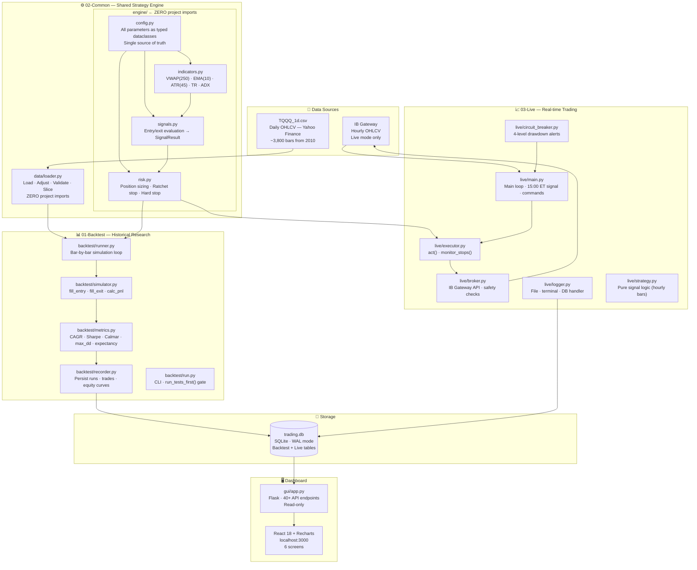
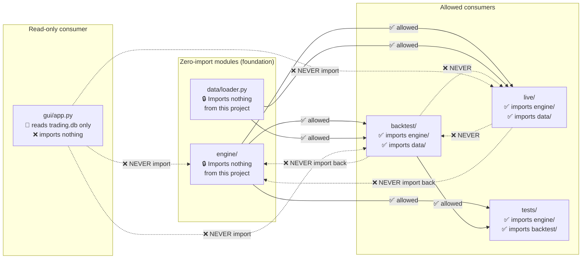
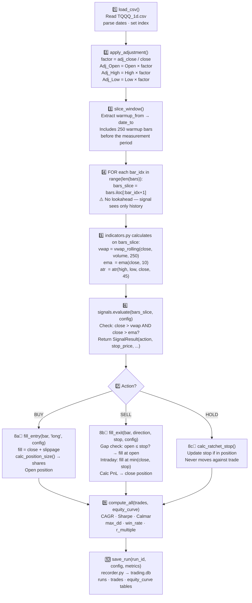
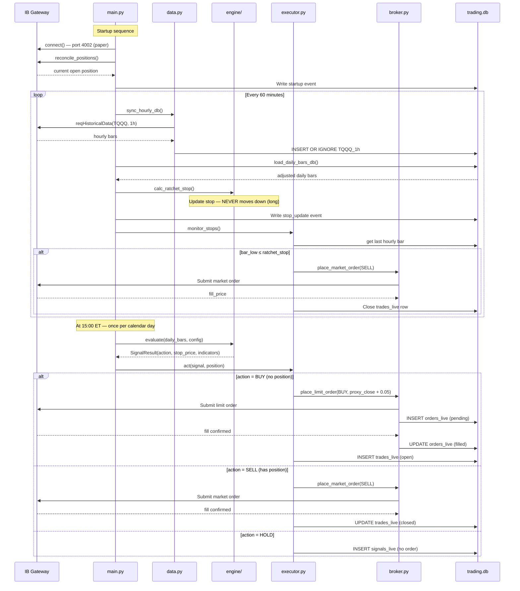
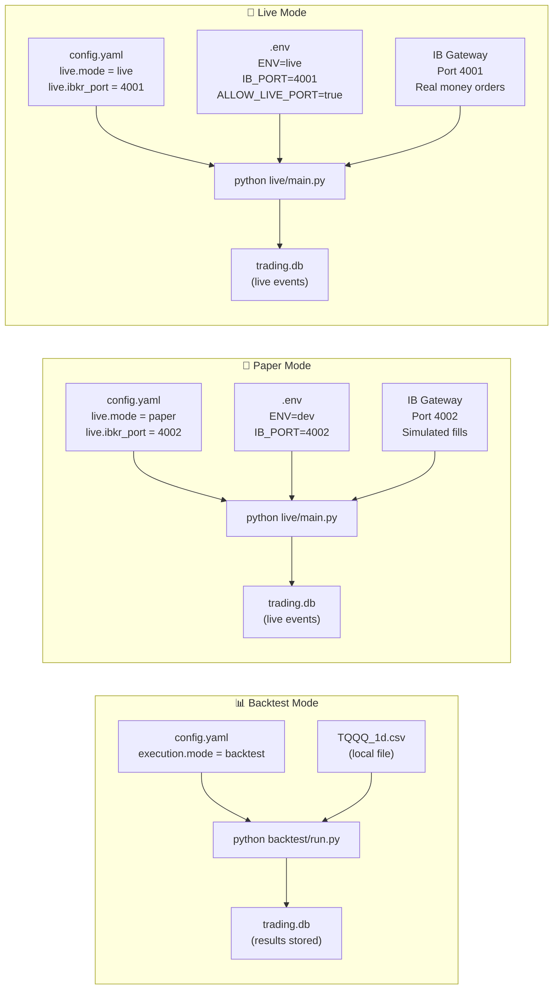
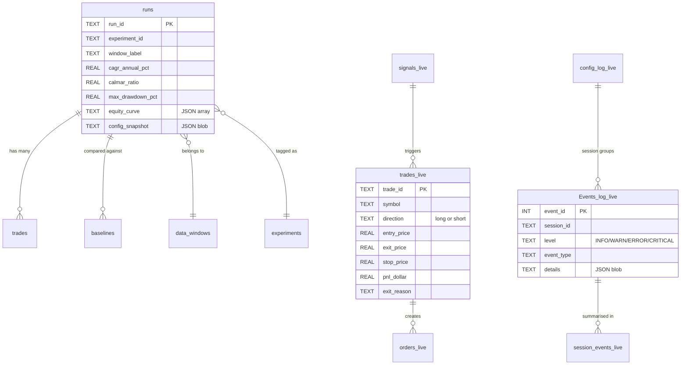

# System Architecture

> **Plain English:** The system is split into three physically separate folders. The middle layer (engine) contains all trading logic and is shared by both the backtest and the live trading systems. Neither the backtest nor the live system ever imports from each other — they share only the engine. The dashboard never writes to the database; it only reads.

**Related pages:** [Strategy Logic](Strategy-Logic) · [Ref-Engine-Core](Ref-Engine-Core) · [Database Schema](Database-Schema) · [Setup & Deployment](Setup-Deployment)

---

## Table of Contents

1. [Three-Tier Module Map](#three-tier-module-map)
2. [The Import Wall — What Can Import What](#the-import-wall)
3. [Directory Structure](#directory-structure)
4. [Backtest Data Flow](#backtest-data-flow)
5. [Live Trading Data Flow](#live-trading-data-flow)
6. [Deployment Modes](#deployment-modes)
7. [Technology Stack](#technology-stack)
8. [Database Overview](#database-overview)

---

## Three-Tier Module Map

> **How to read:** Each box is a module folder. Solid arrows show allowed data/import direction. The engine layer (centre) has no arrows coming back from backtest or live — it knows nothing about them. This is intentional: the engine can be tested, swapped, or improved without touching either execution path.



---

## The Import Wall

> **How to read:** Green arrows = allowed imports. Red dashed lines with ❌ = permanently forbidden. The engine folder is a self-contained island — if it imported from backtest or live, a circular dependency would exist and the shared code model would break. Verified after every batch with `grep -r "from backtest" engine/`.



**Verification commands — run after every change to import structure:**

```bash
grep -r "from backtest" engine/   # must return nothing
grep -r "from live" engine/       # must return nothing
grep -r "from backtest" live/     # must return nothing
grep -r "from live" backtest/     # must return nothing
```

---

## Directory Structure

```
e:\Trading\tqqq-dev\
│
├── 01-Backtest/                      ← Historical research & optimisation
│   ├── backtest/
│   │   ├── run.py                    ← CLI entry point (run_tests_first gate)
│   │   ├── runner.py                 ← Bar-by-bar simulation loop
│   │   ├── simulator.py              ← fill_entry, fill_exit, calc_pnl
│   │   ├── metrics.py                ← CAGR, Sharpe, Calmar, max_dd
│   │   └── recorder.py               ← Persist to trading.db
│   ├── scripts/
│   │   ├── run_all_windows.py        ← Run one experiment on all windows
│   │   ├── run_phase2.py             ← Phase 2 parameter sweep runner
│   │   ├── backfill_equity_curves.py ← Recompute missing equity curves
│   │   └── rerun_all_with_warmup.py  ← Force rerun with new warmup params
│   ├── experiments/                  ← YAML configs for each experiment
│   │   ├── baseline_bh.yaml          ← B1: Buy & hold baseline
│   │   ├── baseline_atr45.yaml       ← B2: Default strategy baseline
│   │   ├── exp_018_atr_wider.yaml    ← Best config (Calmar leader)
│   │   └── *.yaml                    ← All other experiment configs
│   └── tests/
│       ├── integration/test_backtest.py
│       ├── regression/test_regression.py
│       ├── stress/test_stress.py
│       └── unit/test_metrics.py
│
├── 02-Common/                        ← Shared engine (used by backtest AND live)
│   ├── engine/
│   │   ├── config.py                 ← All dataclasses + load_config()
│   │   ├── indicators.py             ← vwap_rolling, ema, atr, true_range, adx
│   │   ├── signals.py                ← evaluate() → SignalResult
│   │   ├── risk.py                   ← calc_position_size, calc_ratchet_stop
│   │   └── ml/                       ← Placeholder (Phase 4)
│   ├── data/
│   │   └── loader.py                 ← load_csv, apply_adjustment, validate_data
│   └── tests/unit/
│       ├── test_config.py
│       ├── test_indicators.py
│       ├── test_signals.py
│       ├── test_risk.py
│       ├── test_data.py
│       └── test_verdict.py
│
├── 03-Live/                          ← Paper and live trading
│   ├── live/
│   │   ├── main.py                   ← Main loop (1,383 lines)
│   │   ├── executor.py               ← act(), monitor_stops()
│   │   ├── broker.py                 ← IB Gateway wrapper (653 lines)
│   │   ├── strategy.py               ← Pure signal logic for hourly bars
│   │   ├── circuit_breaker.py        ← 4-level drawdown alerts
│   │   ├── logger.py                 ← 3-tier logging (file/terminal/DB)
│   │   ├── db.py                     ← All DB reads/writes
│   │   ├── db_setup.py               ← Schema creation (13 tables)
│   │   ├── data.py                   ← Fetch hourly bars from IBKR
│   │   ├── validate.py               ← run_readiness_check() — 5 checks
│   │   ├── config.py                 ← .env loader
│   │   ├── lock_manager.py           ← PID lock + emergency lock
│   │   └── process_manager.py        ← Start/stop/kill main.py
│   ├── gui/
│   │   ├── app.py                    ← Flask backend (2,900 lines, 40+ routes)
│   │   ├── frontend/src/             ← React 18 UI
│   │   │   ├── App.js                ← Router (6 screens)
│   │   │   ├── screens/              ← ExperimentsScreen, EquityScreen, etc.
│   │   │   ├── components/           ← Shared UI components
│   │   │   ├── styles/theme.js       ← Colour tokens (LOCKED)
│   │   │   └── styles/format.js      ← Number/date formatters (LOCKED)
│   │   └── templates/                ← Jinja2 HTML (IB control panel, session)
│   └── tests/
│       ├── test_phase3_batch1.py     ← DB, data, executor, logger, validate
│       └── test_phase3_batch2.py     ← Broker, executor, main, signal match
│
├── experiments/                      ← Root-level experiment runners
│   ├── run_baseline_hourly_all_windows.py
│   ├── run_exp_hourly_all_windows.py
│   └── compare_daily_vs_hourly.py
│
├── docs/                             ← Internal reference docs
│   ├── wiki/                         ← This wiki (copy to GitHub Wiki)
│   ├── fill_exit_bug_history.md      ← v0.6.6/v0.6.7 bug history
│   └── ib_gateway_process.md         ← IB Gateway process architecture
│
├── config.yaml                       ← Active strategy config (DO NOT COMMIT)
├── config.yaml.example               ← Template for new machines
├── trading.db                        ← SQLite database (DO NOT COMMIT)
├── .env                              ← Environment variables (DO NOT COMMIT)
├── backup.py                         ← Milestone backup to Google Drive
├── conftest.py                       ← pytest path setup (adds all sub-roots)
├── pytest.ini                        ← Test discovery config
└── requirements.txt                  ← 13 pinned Python dependencies
```

---

## Backtest Data Flow

> **How to read:** Each numbered step is a function call. The warmup bars (250) run through the loop to initialise indicators but are excluded from metrics. The `iloc[:bar_idx+1]` slice at step 4 is the lookahead prevention mechanism — the signal sees only the past, never the future.



**Lookahead prevention — critical detail:**

```python
# WRONG — uses future data
signal = evaluate(bars, config, symbol)

# CORRECT — only data up to current bar
signal = evaluate(bars.iloc[:bar_idx + 1], config, symbol)
#                         ^^^^^^^^^^^^^^^^
#                 Nine characters that determine result validity
```

---

## Live Trading Data Flow

> **How to read:** The live loop runs continuously. At 15:00 ET each day, the signal path fires once. Every other minute, the stop monitoring path checks if the position should be closed. Both paths write to `trading.db`, which the dashboard reads.



---

## Deployment Modes



**Critical safety rule:** Port 4002 (paper) and port 4001 (live) are enforced in [`broker.py:_safety_check()`](Ref-IB-Broker#_safety_check). Any mismatch raises `RuntimeError` before any order is placed. See [IB Gateway Integration](IB-Gateway-Integration#safety-checks) for full details.

| Attribute | Backtest | Paper | Live |
|-----------|---------|-------|------|
| IB Gateway required | No | Yes | Yes |
| Real money | No | No | **Yes** |
| Port | — | 4002 | 4001 |
| `dry_run` flag | n/a | `true` recommended | `false` |
| DB tables used | `runs`, `trades`, `baselines` | `*_live` tables | `*_live` tables |
| Fills | Simulated (close/stop/open) | IB simulated | IB real |

---

## Technology Stack

| Layer | Technology | Version | Purpose |
|-------|-----------|---------|---------|
| Language | Python | 3.9+ | All backend code |
| Data | pandas | 2.2.3 | DataFrame operations |
| Data | numpy | 1.26.4 | Numerical calculations |
| Config | pyyaml | 6.0.1 | YAML config loading |
| Data source | yfinance | 0.2.31 | Yahoo Finance download |
| IB API | ib_insync | 0.9.86 | Interactive Brokers wrapper |
| Web backend | Flask | 3.0.0 | Dashboard API server |
| Web server | waitress | — | Production WSGI |
| Web frontend | React 18 | — | Dashboard UI |
| Charts | Recharts | — | Equity curves, grids |
| Styling | Tailwind CSS | — | UI styling |
| Database | SQLite | — | WAL mode, no server needed |
| ML (future) | scikit-learn | 1.3.2 | Phase 4 ML features |
| ML (future) | xgboost | 2.0.3 | Phase 4 ML model |
| Market calendar | pandas_market_calendars | 5.3.1.2 | NYSE holiday detection |
| Testing | pytest | 7.4.3 | Test runner |
| Coverage | pytest-cov | 4.1.0 | Code coverage reports |

---

## Database Overview

`trading.db` is a single SQLite file used by both backtest and live systems. The two sections never conflict — they use completely separate tables.



**Backtest tables** (populated by `recorder.py`): `runs`, `trades`, `baselines`, `data_windows`, `experiments`

**Live tables** (populated by `db.py` / `db_setup.py`): `TQQQ_1h`, `orders_live`, `trades_live`, `signals_live`, `Events_log_live`, `Events_log_live_archive`, `config_log_live`, `circuit_breaker_live`, `daily_equity_live`, `hourly_snapshot_live`, `session_events_live`, `nav_snapshots`, `process_heartbeat`

> Full schema with all columns and sample queries: [Database Schema](Database-Schema)

---

## Key Architectural Decisions

| Decision | What | Why |
|----------|------|-----|
| **Engine isolation** | `engine/` has zero project imports | Enables unit testing without any I/O; reusable across strategies |
| **SQLite WAL mode** | Write-Ahead Logging enabled | Allows concurrent reads while live loop writes |
| **Flat config** | Single `config.yaml` → `Config` dataclass | One source of truth; config snapshots stored in DB for reproducibility |
| **No auto-correct** | Position mismatch aborts startup | Prevents data loss from wrong assumption about which source is authoritative |
| **Manual EMA loop** | `ema()` uses manual loop, not `pandas.ewm()` | Exact control over seeding; `ewm()` produces different results at boundary |
| **Gap-aware fill** | `fill_exit()` checks open vs stop | Prevents unrealistic fills when stock gaps through stop overnight |
| **Warmup = VWAP period** | `warmup_bars = 250` | Matches longest indicator (VWAP); shorter warmup → NaN signals |

> Impact of changing any of these: [Impact Matrix](Impact-Matrix)
> Full function signatures: [Ref-Engine-Core](Ref-Engine-Core)
